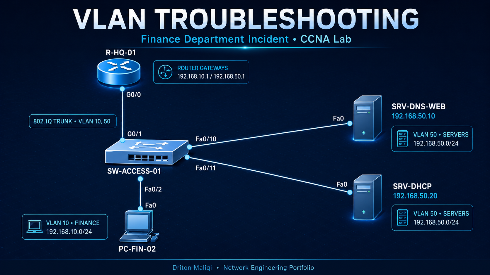
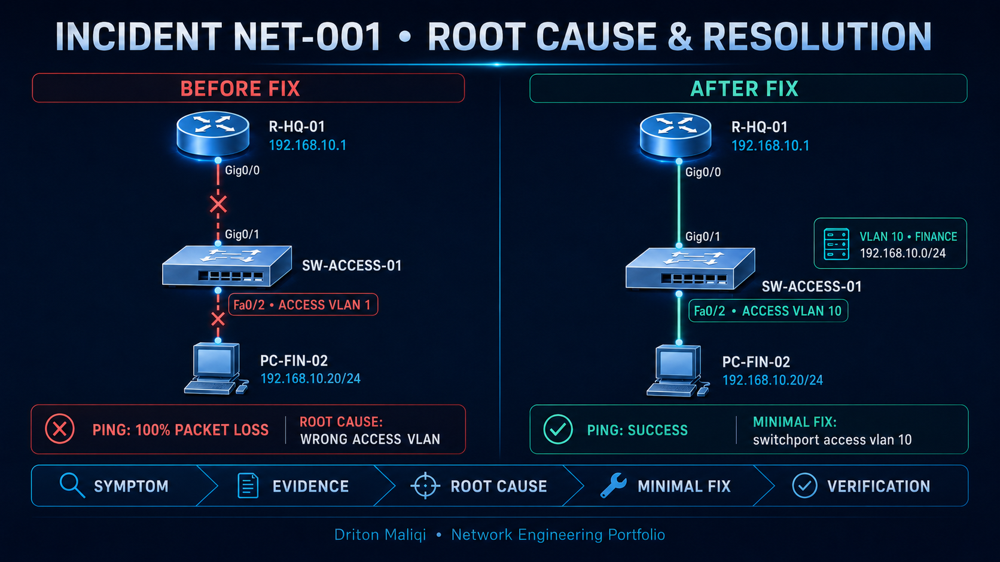
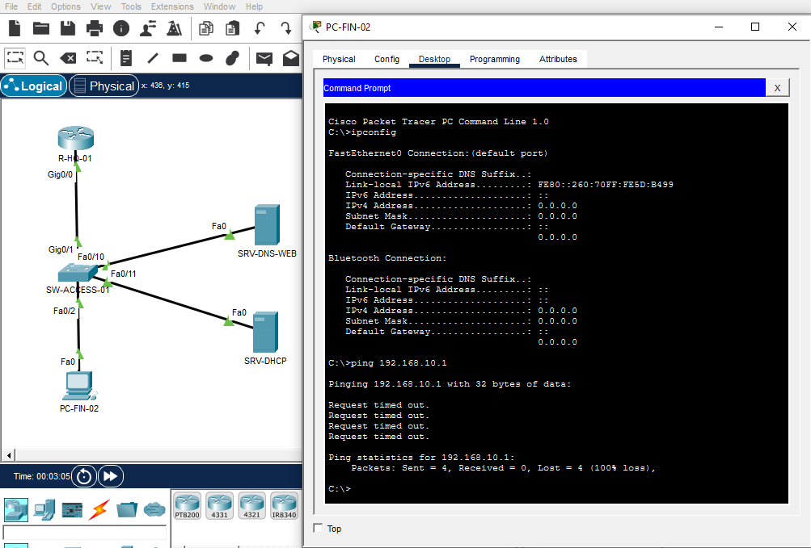
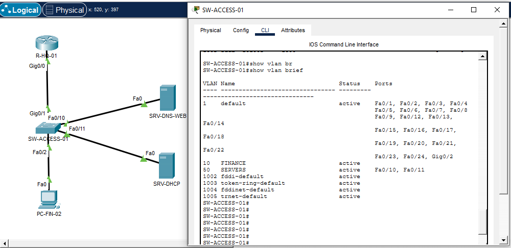
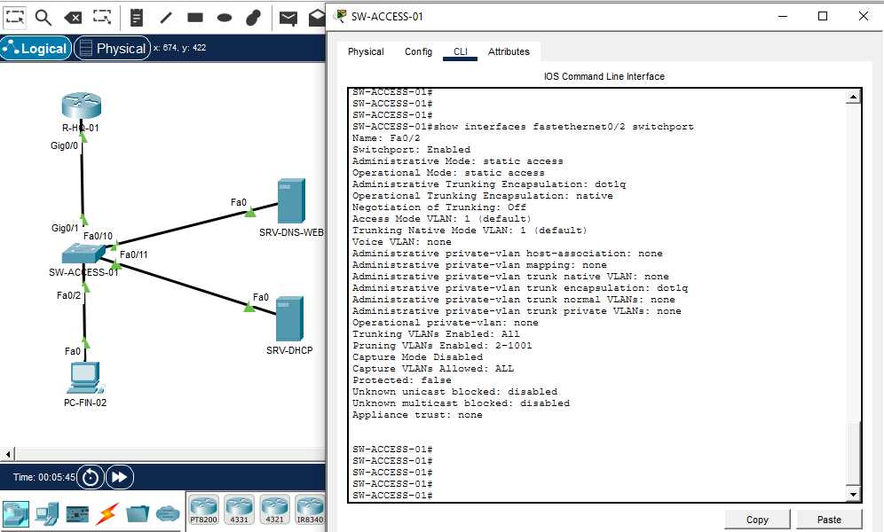
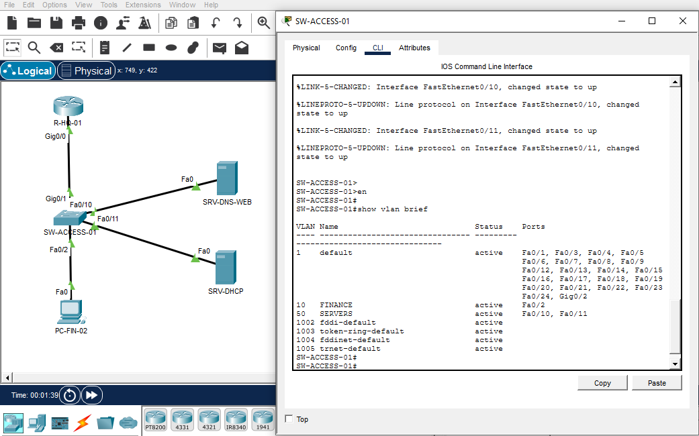
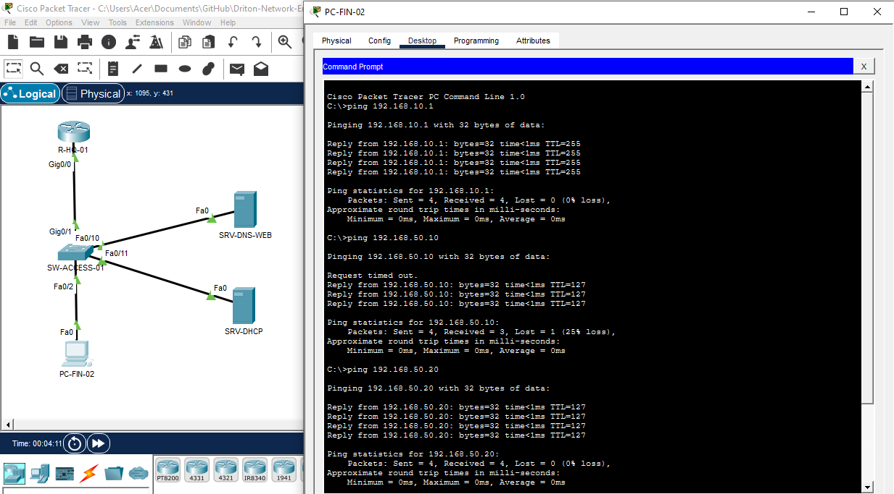
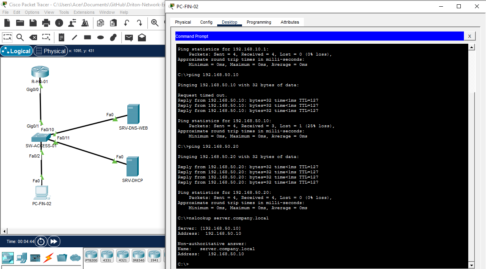

# VLAN Troubleshooting – Finance Department

## Project Overview

This project documents a realistic enterprise troubleshooting incident in which a Finance department workstation could not reach its default gateway, internal server, or the Internet.

**Status:** Resolved and verified  
**Engineer:** Driton Maliqi  
**Level:** CCNA / Junior Network Engineer / NOC  
**Environment:** Cisco Packet Tracer and Cisco IOS

## Technologies Demonstrated

- IPv4 and DHCP verification
- Cisco VLANs
- Access port configuration
- Layer 1–3 troubleshooting
- Inter-VLAN routing verification
- DNS testing
- Cisco IOS commands
- Incident documentation

## Expected Traffic Path

PC-FIN-02 → SW-ACCESS-01 → R-HQ-01 → Company Server

## Network Information

| Component | Expected value |
|---|---|
| Workstation | PC-FIN-02 |
| IPv4 address | 192.168.10.20/24 |
| Default gateway | 192.168.10.1 |
| DHCP server | 192.168.50.20 |
| DNS server | 192.168.50.10 |
| Switch interface | FastEthernet0/2 |
| Required VLAN | VLAN 10 – FINANCE |
| Internal server | 192.168.50.10 |

## Reported Incident

PC-FIN-02 could not access the company server or the Internet. The server infrastructure and router-to-switch trunk remained operational.

## Troubleshooting Process

### 1. Client configuration

Command:

    ipconfig /all

The workstation had a valid DHCP configuration:

    IPv4 Address    : 192.168.10.20
    Subnet Mask     : 255.255.255.0
    Default Gateway : 192.168.10.1
    DHCP Server     : 192.168.50.20
    DNS Server      : 192.168.50.10

### 2. Gateway test

Command:

    ping 192.168.10.1

Result:

    Request timed out.
    Packets: Sent = 4, Received = 0, Lost = 4 (100% loss)

The workstation could not reach its nearest Layer 3 boundary.

### 3. Switchport verification

Command:

    show ip interface brief

FastEthernet0/2 was up/up, confirming that the physical connection was operational.

### 4. VLAN verification

Commands:

    show vlan brief
    show interfaces fastethernet0/2 switchport

Relevant output:

    VLAN 1   default   active   Fa0/2
    VLAN 10  FINANCE   active
    Access Mode VLAN: 1 (default)

## Root Cause

SW-ACCESS-01 interface FastEthernet0/2 was assigned to VLAN 1 instead of VLAN 10 – FINANCE.

## Resolution

    configure terminal
    interface fastethernet0/2
     switchport mode access
     switchport access vlan 10
    end

## Verification

| Test | Final result |
|---|---|
| Fa0/2 assigned to VLAN 10 | Passed |
| Ping 192.168.10.1 | Passed |
| Ping 192.168.50.10 | Passed |
| DNS resolution | Passed |
| Company server access | Passed |

## Incident Resolution Visual

## Troubleshooting Method

Client configuration → Gateway → Physical port → VLAN membership → Correction → End-to-end verification

## Skills Demonstrated

- Fault isolation from endpoint to destination
- Layer 1, Layer 2, and Layer 3 troubleshooting
- Evidence-based diagnosis
- Minimal corrective configuration
- End-to-end verification
- Professional incident documentation

## Technical Evidence

### Before Fix – Connectivity Failure

### Before Fix – VLAN Membership

### Before Fix – Switchport Configuration

### After Fix – VLAN 10 Assignment

### After Fix – Connectivity Verification

### After Fix – DNS Verification

## Downloadable Packet Tracer Labs

- [Broken troubleshooting scenario](./lab/VLAN-Troubleshooting-Broken.pkt)
- [Resolved and verified scenario](./lab/VLAN-Troubleshooting-Resolved.pkt)

## Device Configurations

- [R-HQ-01 relevant configuration](./configurations/R-HQ-01-Relevant-Config.txt)
- [SW-ACCESS-01 before the fix](./configurations/SW-ACCESS-01-Before-Fix.txt)
- [SW-ACCESS-01 resolved configuration](./configurations/SW-ACCESS-01-Resolved-Config.txt)
- [Verification command checklist](./configurations/Verification-Commands.txt)

## Original Packet Tracer Topology

[View the original Packet Tracer topology](./topology/VLAN-Troubleshooting-Raw.png)

