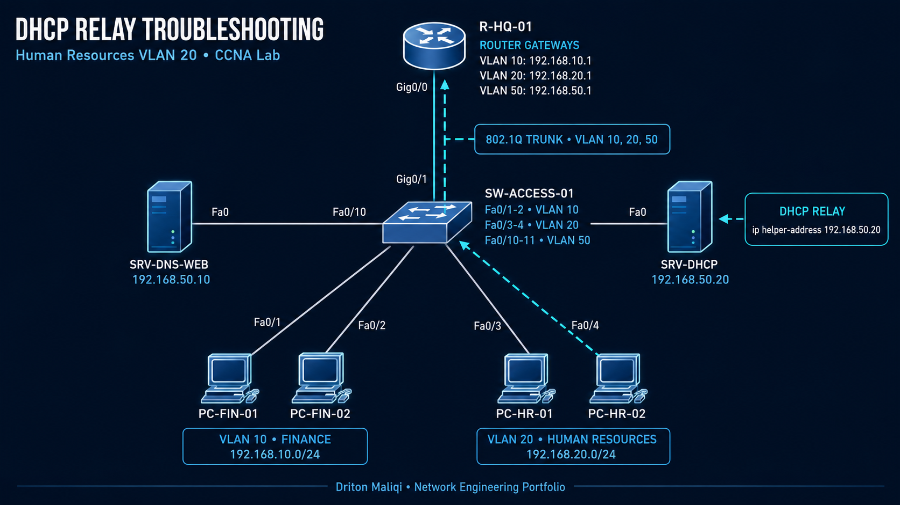
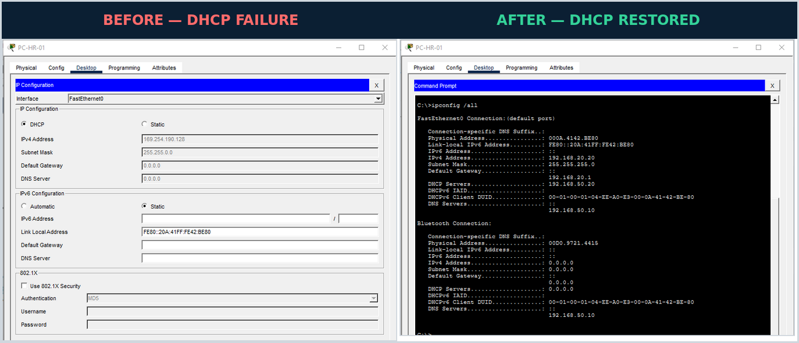

# DHCP Relay Troubleshooting – Human Resources

## Project Overview

This project documents a realistic enterprise DHCP incident in which Human Resources workstations in VLAN 20 could not obtain valid IPv4 configuration from a centralized DHCP server in VLAN 50.

**Status:** Resolved and verified  
**Engineer:** Driton Maliqi  
**Level:** CCNA / Junior Network Engineer / NOC  
**Environment:** Cisco Packet Tracer and Cisco IOS

## Technologies Demonstrated

- DHCP DORA process
- DHCP relay with `ip helper-address`
- Router-on-a-stick and 802.1Q subinterfaces
- VLAN access-port and trunk verification
- IPv4 addressing and APIPA diagnosis
- Inter-VLAN routing verification
- DNS resolution testing
- Evidence-based fault isolation
- Professional incident documentation

## Expected Traffic Path

PC-HR-01/02 → SW-ACCESS-01 → R-HQ-01 G0/0.20 → DHCP Relay → SRV-DHCP

## Network Information

| Component | Expected value |
|---|---|
| Human Resources VLAN | VLAN 20 – HUMAN_RESOURCES |
| HR subnet | 192.168.20.0/24 |
| HR default gateway | 192.168.20.1 |
| HR switch interfaces | FastEthernet0/3 and FastEthernet0/4 |
| Router subinterface | GigabitEthernet0/0.20 |
| Switch trunk | GigabitEthernet0/1 |
| Allowed VLANs | 10, 20, 50 |
| DHCP server | 192.168.50.20 |
| DNS and web server | 192.168.50.10 |
| PC-HR-01 final lease | 192.168.20.20/24 |
| PC-HR-02 final lease | 192.168.20.21/24 |

## Reported Incident

Human Resources workstations could not obtain valid DHCP configuration. PC-HR-01 assigned itself an APIPA address in `169.254.0.0/16` and had no IPv4 default gateway or DNS server. Finance clients continued to receive valid leases.

## Troubleshooting Process

### 1. Confirm the endpoint symptom

PC-HR-01 displayed:

    IPv4 Address    : 169.254.190.128
    Subnet Mask     : 255.255.0.0
    Default Gateway : 0.0.0.0
    DNS Server      : 0.0.0.0

The APIPA address confirmed that the DHCP exchange had failed.

### 2. Test a known-good control client

PC-FIN-01 in VLAN 10 received a valid lease, gateway, and DNS server. This proved that the DHCP service was operational and narrowed the incident to the VLAN 20 forwarding path.

### 3. Verify Layer 1 and Layer 2

Commands:

    show ip interface brief
    show vlan brief
    show interfaces fastethernet0/3 switchport
    show interfaces trunk

Results:

- FastEthernet0/3 and FastEthernet0/4 were up/up.
- Both HR ports were assigned to VLAN 20.
- VLAN 20 was active.
- VLAN 20 was allowed, active, and forwarding on trunk GigabitEthernet0/1.

### 4. Verify Layer 3 and DHCP services

R-HQ-01 subinterfaces for VLANs 10, 20, and 50 were up/up. The DHCP server contained both FINANCE and HR pools.

### 5. Compare working and failing VLAN configurations

The working VLAN 10 subinterface contained:

    ip helper-address 192.168.50.20

The failing VLAN 20 subinterface did not contain a helper address. Because DHCP Discover is a broadcast, it could not cross the router to reach the centralized server in VLAN 50.

## Root Cause

R-HQ-01 interface GigabitEthernet0/0.20 was missing `ip helper-address 192.168.50.20`.

## Resolution

    configure terminal
    interface GigabitEthernet0/0.20
     ip helper-address 192.168.50.20
    end

This was the only corrective configuration change.

## Verification

| Test | Final result |
|---|---|
| DHCP relay configured on G0/0.20 | Passed |
| PC-HR-01 received 192.168.20.20/24 | Passed |
| PC-HR-02 received 192.168.20.21/24 | Passed |
| Default gateway 192.168.20.1 | Passed |
| DHCP server 192.168.50.20 | Passed |
| DNS server 192.168.50.10 | Passed |
| Ping 192.168.20.1 | Passed – 4/4 replies |
| Ping 192.168.50.10 | Passed after initial ARP resolution |
| `nslookup server.company.local` | Passed – 192.168.50.10 |

## Incident Resolution Visual

## Troubleshooting Method

Endpoint symptom → Known-good control client → Access ports → VLAN membership → Trunk → Router subinterfaces → DHCP pools → Relay comparison → Minimal correction → End-to-end verification

## Skills Demonstrated

- Diagnosing APIPA as a DHCP failure indicator
- Isolating a fault by comparing working and failing VLANs
- Layer 1–3 and network-service troubleshooting
- DHCP relay configuration
- One-change-at-a-time remediation
- Verification on multiple endpoints
- Technical evidence and incident documentation

## Technical Evidence

| # | Evidence | What it proves |
|---|---|---|
| 01 | [HR DHCP failure](./evidence/01-HR-DHCP-Failure-APIPA.png) | PC-HR-01 fell back to APIPA |
| 02 | [Finance control success](./evidence/02-Finance-DHCP-Control-Success.png) | DHCP worked for another VLAN |
| 03 | [Switch interfaces](./evidence/03-Switch-Interfaces-Up.png) | HR ports and uplink were operational |
| 04 | [VLAN membership](./evidence/04-VLAN20-Membership.png) | Fa0/3 and Fa0/4 belonged to VLAN 20 |
| 05 | [HR access port](./evidence/05-HR-Access-Port-VLAN20.png) | Fa0/3 was a static VLAN 20 access port |
| 06 | [Trunk verification](./evidence/06-Trunk-VLAN20-Allowed.png) | VLAN 20 was allowed and forwarding |
| 07 | [Router interfaces](./evidence/07-Router-Subinterfaces-Up.png) | Router subinterfaces were up/up |
| 08 | [DHCP pools](./evidence/08-DHCP-Pools-Configured.png) | HR and Finance pools existed |
| 09 | [Missing relay](./evidence/09-Root-Cause-Missing-DHCP-Relay.png) | G0/0.20 lacked the helper address |
| 10 | [Relay correction](./evidence/10-After-Fix-DHCP-Relay-Configured.png) | The minimal fix was applied |
| 11 | [PC-HR-01 lease](./evidence/11-PC-HR01-DHCP-Lease-Success.png) | First HR client received a valid lease |
| 12 | [End-to-end tests](./evidence/12-End-to-End-Verification.png) | Gateway, server, and DNS tests succeeded |
| 13 | [PC-HR-02 lease](./evidence/13-PC-HR02-DHCP-Lease-Success.png) | Service worked for a second HR client |
| 14 | [Before and after](./evidence/14-Incident-Before-After.png) | Visual comparison of failure and restoration |

## Downloadable Packet Tracer Labs

- [Broken troubleshooting scenario](./lab/DHCP-Troubleshooting-Broken.pkt)
- [Resolved and verified scenario](./lab/DHCP-Troubleshooting-Resolved.pkt)

## Device Configurations

- [R-HQ-01 before the fix](./configurations/R-HQ-01-Before-Fix.txt)
- [R-HQ-01 resolved configuration](./configurations/R-HQ-01-Resolved-Config.txt)
- [SW-ACCESS-01 relevant configuration](./configurations/SW-ACCESS-01-Relevant-Config.txt)
- [DHCP server pools](./configurations/DHCP-Server-Pools.txt)
- [Verification command checklist](./configurations/Verification-Commands.txt)

## Original Packet Tracer Topology

[View the original Packet Tracer topology](./topology/DHCP-Troubleshooting-Topology-Raw.png)

