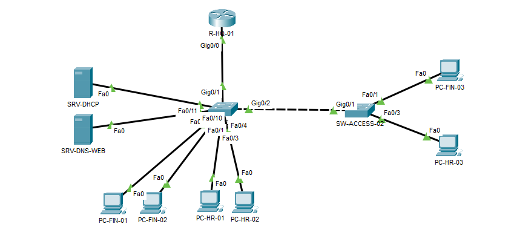

# Project 03 - Trunk Troubleshooting Evidence

## Topology



The lab contains two access switches connected through an IEEE 802.1Q trunk. VLAN 10 serves Finance, VLAN 20 serves Human Resources, and VLAN 50 contains the DHCP and DNS/Web servers.

## Before the Fix

### 1. Valid endpoint configuration


`PC-HR-03` retained a valid DHCP lease in `192.168.20.0/24`, including the expected gateway, DHCP server, and DNS server.

### 2. Original failing test


The affected endpoint could not reach its default gateway `192.168.20.1`.

### 3. Control test


`PC-FIN-03`, connected to the same downstream switch, reached the VLAN 10 gateway successfully. This proved that the physical uplink was operational and narrowed the fault to the VLAN 20 path.

### 4. VLAN membership on SW-ACCESS-02


VLAN 20 was active on `SW-ACCESS-02`, and `Fa0/3` was assigned to `HUMAN_RESOURCES`.

### 5. Healthy downstream access port and trunk


`Fa0/3` operated as an access port in VLAN 20, while `Gi0/1` allowed and forwarded VLANs 10, 20, and 50.

### 6. Root-cause evidence


The remote trunk endpoint `SW-ACCESS-01 Gi0/2` allowed only VLANs 10 and 50. VLAN 20 was missing from the allowed VLAN list.

## Corrective Change

```cisco
configure terminal
interface gigabitethernet0/2
 switchport trunk allowed vlan add 20
end
```

The `add` keyword preserved VLANs 10 and 50 while restoring VLAN 20.

## After the Fix


After the correction, `PC-HR-03` reached its gateway and the internal server, and DNS resolved `server.company.local` to `192.168.50.10`.

## Evidence Summary

| Stage | Evidence | Result |
|---|---|---|
| Endpoint | Valid DHCP configuration | Passed |
| Original test | Ping to `192.168.20.1` | Failed before fix |
| Control test | Finance gateway ping | Passed |
| Access VLAN | `Fa0/3` in VLAN 20 | Passed |
| Downstream trunk | VLAN 20 allowed on `SW-ACCESS-02 Gi0/1` | Passed |
| Upstream trunk | VLAN 20 missing on `SW-ACCESS-01 Gi0/2` | Root cause |
| Verification | Gateway, server, and DNS | Passed after fix |

