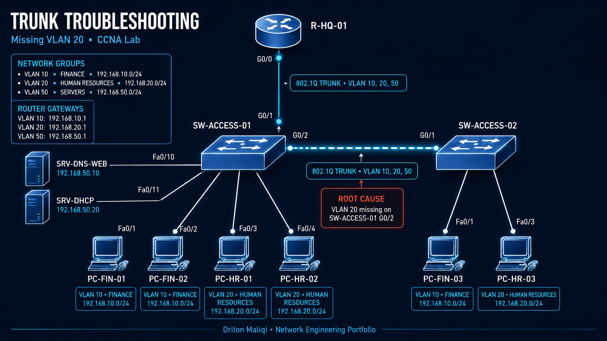
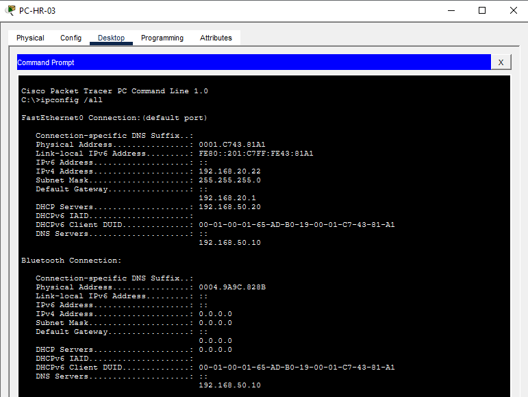
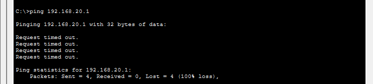
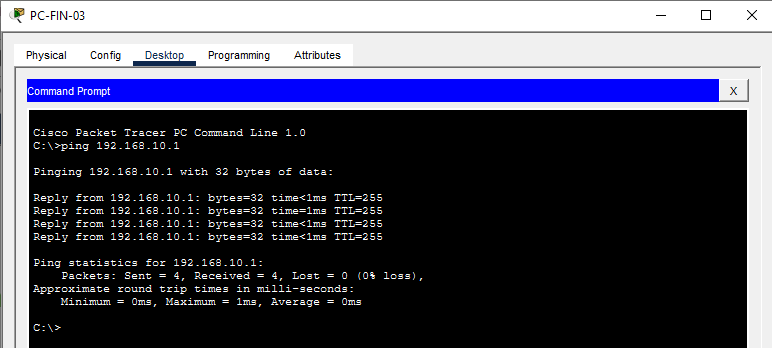
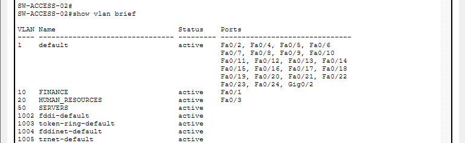
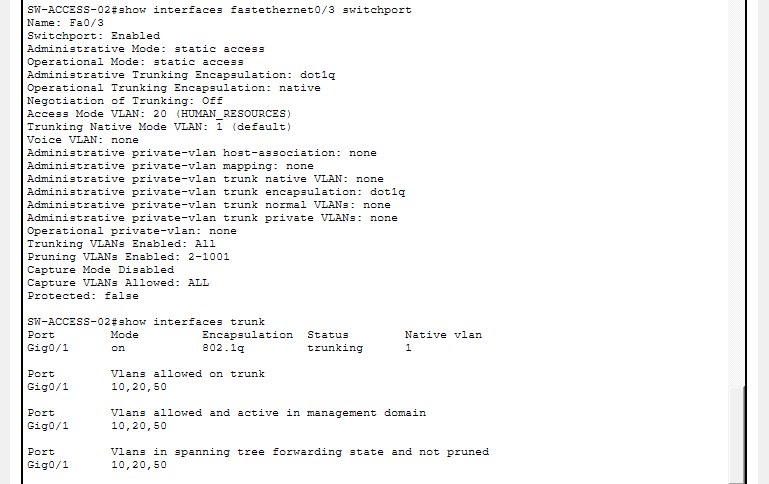
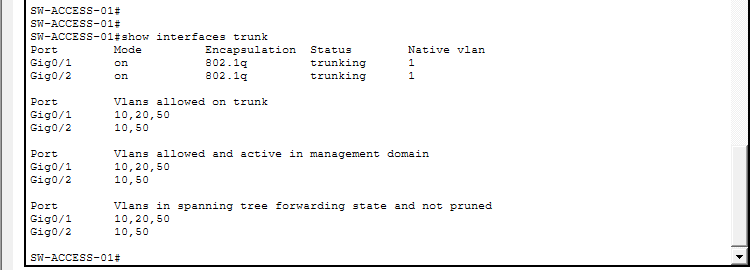
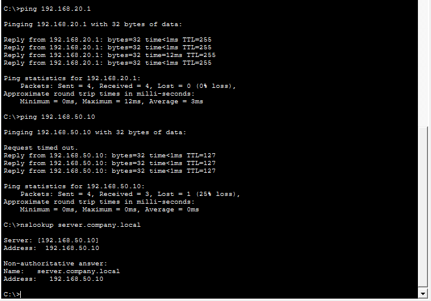

# Trunk Troubleshooting - Missing VLAN 20



## Project Overview

This project documents a realistic inter-switch trunk incident in a segmented enterprise access network. A Human Resources workstation connected to a newly deployed downstream switch retained a valid DHCP lease but could not reach its default gateway or internal services. A Finance workstation on the same switch remained operational.

**Status:** Resolved and verified  
**Incident:** NET-003  
**Engineer:** Driton Maliqi  
**Level:** CCNA / Junior Network Engineer / NOC  
**Environment:** Cisco Packet Tracer and Cisco IOS

## Technologies Demonstrated

- IEEE 802.1Q trunking
- VLAN allowed lists
- VLAN membership and access ports
- Per-VLAN spanning-tree forwarding verification
- Router-on-a-stick inter-VLAN routing
- DHCP relay and DNS verification
- Layer 1-3 fault isolation
- Control testing with a known-good endpoint
- Minimal corrective change
- Professional incident documentation

## Network Design

| Component | Interface or address | Role |
|---|---|---|
| R-HQ-01 | G0/0 and subinterfaces | Inter-VLAN gateway |
| SW-ACCESS-01 | G0/1 | Trunk to R-HQ-01 |
| SW-ACCESS-01 | G0/2 | Trunk to SW-ACCESS-02 |
| SW-ACCESS-02 | G0/1 | Trunk to SW-ACCESS-01 |
| PC-FIN-03 | Fa0/1, VLAN 10 | Known-good Finance endpoint |
| PC-HR-03 | Fa0/3, VLAN 20 | Affected HR endpoint |
| SRV-DNS-WEB | 192.168.50.10 | Internal DNS and web server |
| SRV-DHCP | 192.168.50.20 | Central DHCP server |

## VLAN and Addressing Plan

| VLAN | Name | Subnet | Gateway |
|---|---|---|---|
| 10 | FINANCE | 192.168.10.0/24 | 192.168.10.1 |
| 20 | HUMAN_RESOURCES | 192.168.20.0/24 | 192.168.20.1 |
| 50 | SERVERS | 192.168.50.0/24 | 192.168.50.1 |

## Reported Incident

`PC-HR-03` could not reach its default gateway, the internal server, or DNS. `PC-FIN-03`, connected to the same downstream switch, remained operational.

Expected HR traffic path:

```text
PC-HR-03
  -> SW-ACCESS-02 Fa0/3 (access VLAN 20)
  -> SW-ACCESS-02 G0/1 (802.1Q trunk)
  -> SW-ACCESS-01 G0/2 (802.1Q trunk)
  -> SW-ACCESS-01 G0/1
  -> R-HQ-01 G0/0.20
```

## Troubleshooting Process

### 1. Validate the endpoint

```text
IPv4 address    192.168.20.22
Subnet mask     255.255.255.0
Default gateway 192.168.20.1
DHCP server     192.168.50.20
DNS server      192.168.50.10
```



The endpoint retained a valid DHCP lease, but the original gateway test failed.



### 2. Run a control test

`PC-FIN-03` successfully reached `192.168.10.1`. This confirmed that the physical inter-switch link was operational and that the failure was VLAN-specific.



### 3. Verify the downstream access switch

`SW-ACCESS-02` showed:

- VLAN 20 active;
- `Fa0/3` operating as an access port in VLAN 20;
- `G0/1` trunking and forwarding VLANs 10, 20, and 50.





### 4. Inspect the remote trunk endpoint

`SW-ACCESS-01 G0/2` was operational as a trunk, but its allowed VLAN list contained only VLANs 10 and 50.



## Root Cause

VLAN 20 was missing from the allowed VLAN list on `SW-ACCESS-01 G0/2`. The physical trunk remained up, and other allowed VLANs continued to work, making this a partial and VLAN-specific outage.

## Corrective Configuration

```cisco
configure terminal
interface gigabitethernet0/2
 switchport trunk allowed vlan add 20
end
```

The `add` keyword was used to preserve the existing VLAN 10 and VLAN 50 entries.

## Verification

| Test | Expected result | Result |
|---|---|---|
| `show interfaces trunk` | G0/2 allows 10,20,50 | Passed |
| HR gateway ping | Reply from 192.168.20.1 | Passed |
| Internal server ping | Reply from 192.168.50.10 | Passed |
| DNS lookup | server.company.local -> 192.168.50.10 | Passed |
| Finance control test | VLAN 10 remains operational | Passed |



## Troubleshooting Method

```text
Define the affected flow
  -> validate endpoint configuration
  -> test the default gateway
  -> compare with a known-good VLAN
  -> verify access VLAN membership
  -> verify both trunk endpoints
  -> apply one minimal change
  -> repeat the original failed test
  -> verify adjacent services
```

## Key Lesson

An operational trunk does not prove that every required VLAN can cross it. Always compare the allowed, active, and spanning-tree forwarding VLAN lists on both trunk endpoints.

## Project Files

```text
03-Trunk-Troubleshooting/
|-- configurations/
|-- evidence/
|-- lab/
|   |-- Trunk-Troubleshooting-Base.pkt
|   |-- Trunk-Troubleshooting-Broken.pkt
|   `-- Trunk-Troubleshooting-Resolved.pkt
|-- topology/
|-- EVIDENCE-MANIFEST.md
|-- incident-report.md
`-- README.md
```


