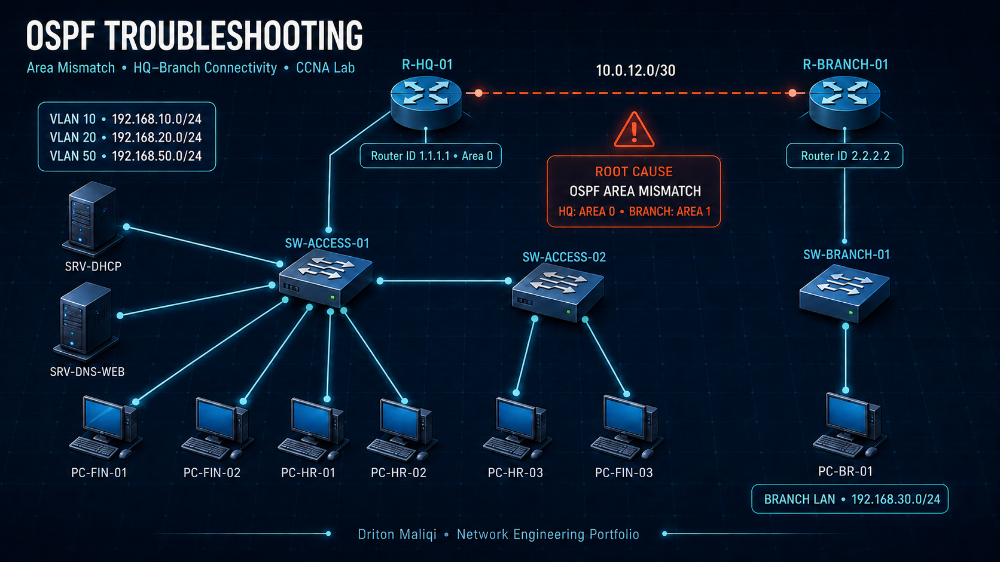
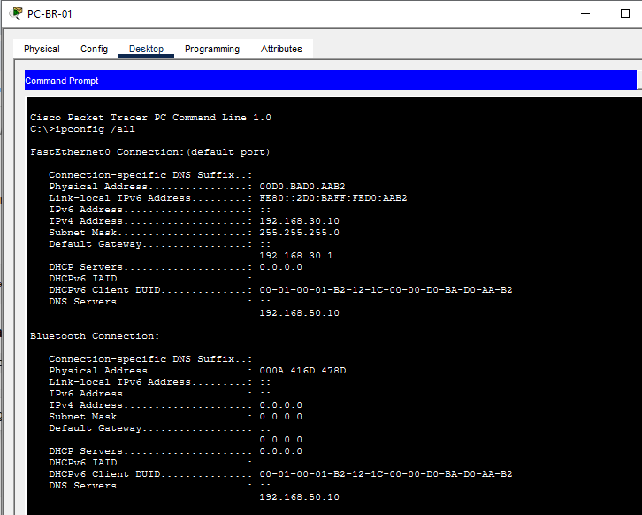
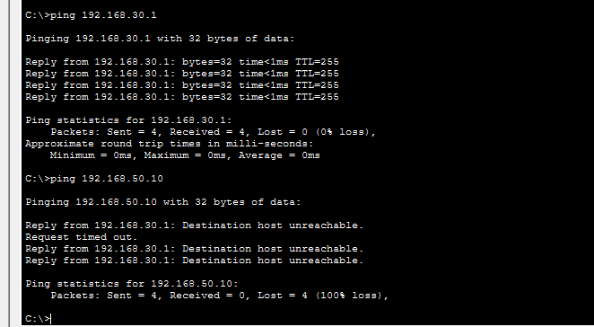
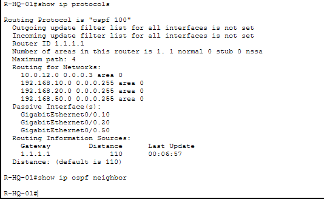
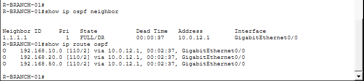
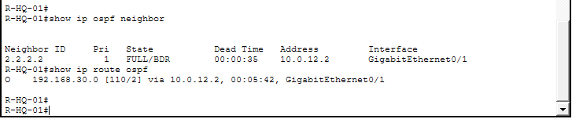
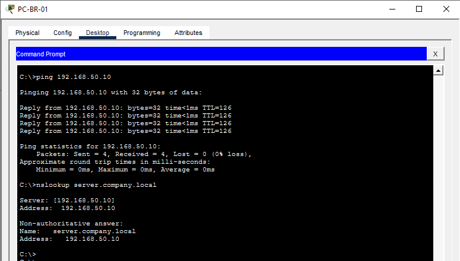
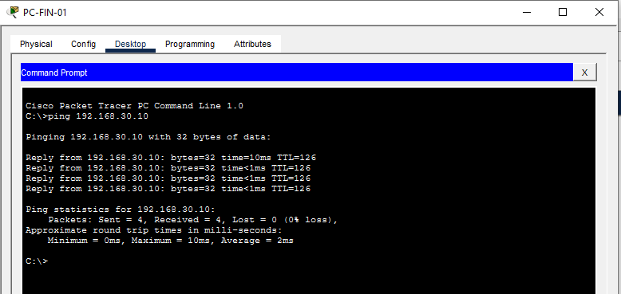

# OSPF Troubleshooting – Area Mismatch



## Project Overview

This project documents a realistic HQ-to-Branch routing incident. The WAN link remained reachable, but OSPF adjacency failed and the Branch lost all dynamically learned routes to the HQ networks.

**Status:** Resolved and verified  
**Engineer:** Driton Maliqi  
**Level:** CCNA / Junior Network Engineer / NOC  
**Environment:** Cisco Packet Tracer and Cisco IOS  
**Incident:** NET-004

## Technologies Demonstrated

- OSPF single-area design
- OSPF neighbor-state verification
- Router IDs and network statements
- OSPF area-mismatch troubleshooting
- Dynamic route verification
- HQ-to-Branch WAN connectivity
- Endpoint-to-destination fault isolation
- DNS and return-path verification
- Professional incident documentation

## Expected Traffic Path

```text
PC-BR-01 → SW-BRANCH-01 → R-BRANCH-01 → WAN 10.0.12.0/30
         → R-HQ-01 → SW-ACCESS-01 → SRV-DNS-WEB
```

## Network Information

| Component | Address / Role |
|---|---|
| R-HQ-01 router ID | 1.1.1.1 |
| R-BRANCH-01 router ID | 2.2.2.2 |
| R-HQ-01 G0/1 | 10.0.12.1/30 |
| R-BRANCH-01 G0/0 | 10.0.12.2/30 |
| Finance VLAN 10 | 192.168.10.0/24 |
| Human Resources VLAN 20 | 192.168.20.0/24 |
| Servers VLAN 50 | 192.168.50.0/24 |
| Branch LAN | 192.168.30.0/24 |
| PC-BR-01 | 192.168.30.10/24 |
| Branch gateway | 192.168.30.1 |
| DNS/Web server | 192.168.50.10 |
| OSPF process | 100 |

## Reported Incident

`PC-BR-01` could reach its local default gateway but could not reach the HQ server at `192.168.50.10`. The gateway returned `Destination host unreachable`.





## Troubleshooting Process

### 1. Verify the endpoint

```text
ipconfig /all
ping 192.168.30.1
ping 192.168.50.10
```

The endpoint configuration was correct and the local gateway responded. This proved that the Branch access port, VLAN 30, local switch path, and Branch LAN interface were operational.

### 2. Verify the WAN boundary

```text
R-BRANCH-01# ping 10.0.12.1
Success rate is 100 percent (5/5)
```

The directly connected WAN peer responded, eliminating cabling, interface state, subnetting, and basic IP reachability as the cause.

### 3. Verify OSPF adjacency and routes

```text
show ip ospf neighbor
show ip route ospf
show ip protocols
```

The Branch OSPF neighbor table and OSPF route table were empty. `show ip protocols` revealed that the same WAN network was assigned to different OSPF areas on the two routers.



## Root Cause

The WAN network `10.0.12.0/30` had an **OSPF area mismatch**:

```text
R-HQ-01:     10.0.12.0 0.0.0.3 area 0
R-BRANCH-01: 10.0.12.0 0.0.0.3 area 1
```

OSPF neighbors on the same link must agree on the area ID. Because the area IDs did not match, the routers could ping each other but could not form an OSPF adjacency or exchange routes.

## Corrective Change

Only the incorrect Branch WAN network statement was changed:

```cisco
router ospf 100
 no network 10.0.12.0 0.0.0.3 area 1
 network 10.0.12.0 0.0.0.3 area 0
```

## Verification

After the correction:

- OSPF adjacency reached `FULL` state.
- `R-BRANCH-01` learned the HQ VLAN networks through `10.0.12.1`.
- `PC-BR-01` reached `192.168.50.10` with 0% packet loss.
- DNS resolved `server.company.local` to `192.168.50.10`.
- `PC-FIN-01` reached `PC-BR-01` at `192.168.30.10`, confirming the return path.









## Lab Files

| File | Purpose |
|---|---|
| `OSPF-Troubleshooting-Base.pkt` | Healthy reference topology |
| `OSPF-Troubleshooting-Broken.pkt` | Hidden OSPF area-mismatch incident |
| `OSPF-Troubleshooting-Resolved.pkt` | Corrected and verified topology |

## Reusable Lesson

Successful WAN ping does not prove that a dynamic-routing protocol is healthy. When connected IP reachability works but remote routes are missing, verify the neighbor state and compare protocol parameters on both ends of the link before changing the configuration.

