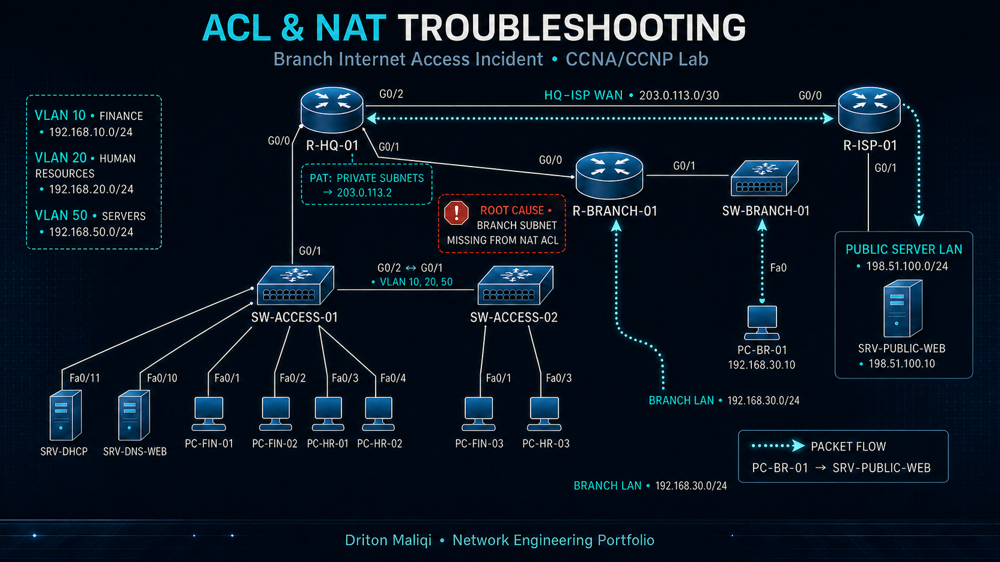
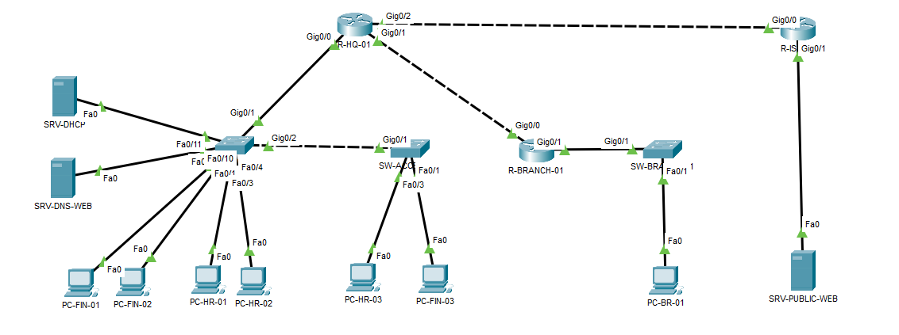

# ACL and NAT Troubleshooting - Branch Internet Access



## Project Overview

This project documents a realistic enterprise troubleshooting incident in which the HQ networks retained public-server access while the Branch network could reach internal resources but could not reach the simulated Internet.

| Field | Value |
|---|---|
| Status | Resolved and verified |
| Engineer | Driton Maliqi |
| Level | CCNA / CCNP Network Engineer / NOC |
| Environment | Cisco Packet Tracer and Cisco IOS |
| Incident | NET-005 |
| Affected network | Branch LAN - `192.168.30.0/24` |
| Public service | `SRV-PUBLIC-WEB` - `198.51.100.10` |

## Technologies Demonstrated

- IPv4 addressing and subnetting
- Multi-site OSPF routing
- OSPF default-route advertisement
- Standard named ACLs
- NAT inside and outside classification
- PAT using an outside-interface address
- NAT translation and counter analysis
- Internet and HTTP service verification
- Endpoint-to-destination fault isolation
- Professional incident documentation

## Topology



### Expected Packet Path

```text
PC-BR-01
  -> SW-BRANCH-01
  -> R-BRANCH-01
  -> OSPF WAN 10.0.12.0/30
  -> R-HQ-01 NAT/PAT boundary
  -> HQ-ISP WAN 203.0.113.0/30
  -> R-ISP-01
  -> SRV-PUBLIC-WEB 198.51.100.10
```

## Addressing Plan

| Component | Interface / role | Address |
|---|---|---|
| Branch LAN | PC-BR-01 | `192.168.30.10/24` |
| Branch gateway | R-BRANCH-01 G0/1 | `192.168.30.1/24` |
| Branch-HQ WAN | R-BRANCH-01 G0/0 | `10.0.12.2/30` |
| Branch-HQ WAN | R-HQ-01 G0/1 | `10.0.12.1/30` |
| Finance | VLAN 10 | `192.168.10.0/24` |
| Human Resources | VLAN 20 | `192.168.20.0/24` |
| Servers | VLAN 50 | `192.168.50.0/24` |
| HQ-ISP WAN | R-HQ-01 G0/2 | `203.0.113.2/30` |
| HQ-ISP WAN | R-ISP-01 G0/0 | `203.0.113.1/30` |
| Public server LAN | R-ISP-01 G0/1 | `198.51.100.1/24` |
| Public server | SRV-PUBLIC-WEB | `198.51.100.10/24` |

## Reported Incident

`PC-BR-01` could reach its default gateway and the internal DNS/web server, while all attempts to reach `198.51.100.10` failed. Finance users at HQ continued to reach the same public server successfully.

This scope indicated that the public service and ISP path were operational and that the fault affected only one inside source network.

## Troubleshooting Process

### 1. Validate the Branch endpoint

```text
ipconfig
ping 192.168.30.1
ping 192.168.50.10
ping 198.51.100.10
```

Results:

- Branch addressing and default gateway were correct.
- The gateway replied successfully.
- The internal server was reachable across OSPF.
- The public server failed with 100% packet loss.

### 2. Verify the Branch routing table

```cisco
show ip route ospf
```

The Branch router contained an OSPF external default route through `10.0.12.1`:

```text
O*E2 0.0.0.0/0 via 10.0.12.1
```

### 3. Verify the outside path from HQ

```cisco
ping 198.51.100.10
```

`R-HQ-01` reached the public server with 100% success, proving that the HQ-ISP WAN, ISP routing, and public server were healthy.

### 4. Inspect NAT and the controlling ACL

```cisco
show ip nat translations
show ip nat statistics
show access-lists NAT_INSIDE
```

No translation was created for `192.168.30.10`. NAT inside/outside interfaces were correct, but `NAT_INSIDE` permitted VLANs 10, 20, and 50 only. The Branch subnet was absent.

## Root Cause

The standard ACL used by PAT did not include `192.168.30.0/24`. Branch packets reached `R-HQ-01`, but they did not match the NAT selection policy and therefore left without a usable global translation.

## Corrective Change

The smallest required change was applied on `R-HQ-01`:

```cisco
configure terminal
ip access-list standard NAT_INSIDE
 permit 192.168.30.0 0.0.0.255
end
```

## Verification

| Test | Final result |
|---|---|
| Branch gateway reachability | Passed |
| Branch-to-HQ internal server | Passed |
| Branch OSPF default route | Present |
| HQ-to-public-server reachability | Passed |
| Branch-to-public-server ping | Passed - 4/4 |
| PAT translation for `192.168.30.10` | Present |
| Branch HTTP access to `198.51.100.10` | Passed |

The successful PAT entry mapped the Branch inside-local address to the HQ outside-interface address `203.0.113.2`.

## Evidence

| Evidence | Purpose |
|---|---|
| [01 - Baseline topology](./evidence/01-Baseline-Topology.png) | Complete HQ, Branch, ISP, and public-server topology |
| [02 - HQ control success](./evidence/02-HQ-Control-Public-Success.png) | Confirms the public service was available to unaffected users |
| [03 - Branch endpoint and gateway](./evidence/03-Before-Branch-Endpoint-Gateway.png) | Validates the Branch IP configuration and local gateway |
| [04 - Internal success and public failure](./evidence/04-Before-Internal-Success-Public-Failure.png) | Isolates the failure beyond the internal routed network |
| [05 - OSPF default route](./evidence/05-Branch-OSPF-Default-Route.png) | Proves Branch has a route toward HQ |
| [06 - HQ outside path](./evidence/06-HQ-Public-Reachability.png) | Proves the ISP/public-server path is healthy |
| [07 - NAT and ACL fault evidence](./evidence/07-Before-NAT-ACL-Evidence.png) | Shows zero translations and the missing Branch subnet |
| [08 - Corrective ACL change](./evidence/08-Fix-NAT-ACL.png) | Documents the smallest corrective change |
| [09 - Service restored](./evidence/09-After-Branch-Ping.png) | Repeats the original failed ICMP test |
| [10 - PAT translation](./evidence/10-After-PAT-Translation.png) | Confirms live Branch PAT entries |
| [11 - HTTP verification](./evidence/11-After-HTTP-Access.png) | Confirms application-layer restoration |

## Lab Files

The local `lab` directory contains:

```text
ACL-NAT-Troubleshooting-Base.pkt
ACL-NAT-Troubleshooting-Broken.pkt
ACL-NAT-Troubleshooting-Resolved.pkt
```

The Broken lab preserves the incident for repeat practice. The Resolved lab contains the verified correction.

## Troubleshooting Lesson

When one subnet cannot reach the Internet but internal routing and other subnets are healthy, verify the NAT selection ACL before changing routes or interfaces. A valid route does not guarantee that a source network is eligible for translation.

