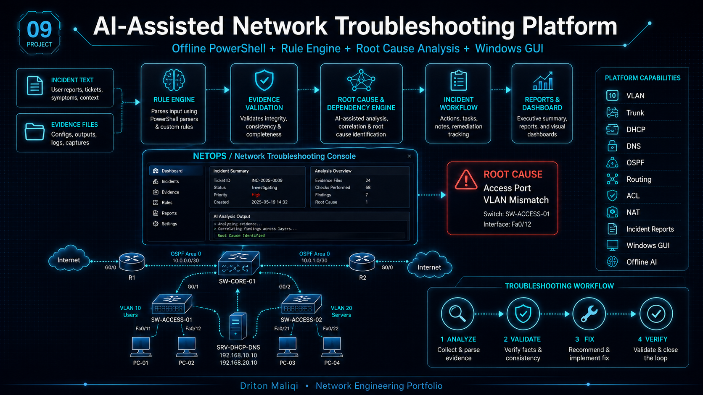

# 09 - NETOPS Network Troubleshooter v6.0



A practical Windows-based Network Engineering and NOC troubleshooting platform built with PowerShell, Windows Forms, deterministic CCNA/CCNP diagnostics, evidence correlation, packet analysis, Root Cause Analysis, incident lifecycle management, automated reporting, and optional local Ollama AI enrichment.

**Current Release:** NETOPS v6.0  
**Diagnostic Approach:** Deterministic CCNA/CCNP RCA + Hybrid AI Fusion  
**Status:** Completed Portfolio Release  
**Focus:** Network troubleshooting, NOC workflows, evidence-driven RCA, automation, and post-fix verification

---

## Why This Project Matters

NETOPS is designed to demonstrate more than isolated Cisco commands. It models a realistic troubleshooting workflow in which evidence is collected, correlated, analyzed, verified, and preserved throughout the incident lifecycle.

What makes the project different:

- Deterministic troubleshooting remains the primary technical decision layer.
- Hybrid AI is used to enrich explanations rather than replace verified evidence.
- Packet captures, routing output, logs, RCA reports, and configuration backups can be associated with an active incident.
- Incidents are not closed just because evidence is complete; post-fix verification is required.
- The workflow is structured around practical Junior Network Engineer / NOC operational tasks.

---

## Platform Architecture

```text
Incident Description / Technical Evidence
                 |
                 v
      Deterministic Rule Engine
                 |
                 v
     Evidence Correlation Layer
                 |
      +----------+-----------+
      |          |           |
      v          v           v
   Routing      Logs       Packets
   Analysis   Correlation   Analysis
      \          |          /
       \         |         /
        +--------+--------+
                 |
                 v
        Root Cause Analysis
                 |
                 v
         Hybrid AI Fusion
                 |
                 v
       Full Incident Analysis
                 |
                 v
        Post-Fix Verification
                 |
                 v
          Incident Closure
```

The deterministic RCA verdict remains the authoritative technical conclusion. Hybrid AI is used to improve explanation, remediation guidance, verification steps, and closure notes.

---

## Core Capabilities

### Troubleshooting Engine

- FAST deterministic analysis
- CCNA / CCNP-oriented rule coverage
- Root-cause vs symptom classification
- Severity assessment
- Confidence scoring
- FIX / VERIFY / COLLECT_MORE / STOP decisions
- Smart next-step recommendations
- Natural-English incident normalization
- Dependency-aware troubleshooting order

### Network Tools

- Ping
- Traceroute
- Cisco show-command reference
- Device Inventory
- Topology View
- Configuration Backup / Restore
- Routing Analysis
- Log Correlation
- Packet Capture / Wireshark
- Packet Analysis
- Root Cause Analysis
- RCA + Hybrid AI Fusion
- Incident Workspace
- Incident Dashboard
- Full Incident Analysis
- Post-Fix Verification / Closure

---

## Incident Lifecycle

NETOPS v6.0 implements a complete evidence-driven incident workflow:

```text
CREATE INCIDENT
      |
      v
COLLECT EVIDENCE
      |
      v
LOG / PACKET / ROUTING ANALYSIS
      |
      v
ROOT CAUSE ANALYSIS
      |
      v
HYBRID AI FUSION
      |
      v
FULL INCIDENT ANALYSIS
      |
      v
POST-FIX VERIFICATION
      |
      v
INCIDENT CLOSURE
```

This prevents premature closure and keeps troubleshooting evidence traceable from detection to resolution.

---

## Incident Workspace

Each active incident can use its own structured evidence directory:

```text
INC-YYYYMMDD-XXX
|
|-- 01-Logs
|-- 02-Packet-Captures
|-- 03-Routing
|-- 04-RCA
|-- 05-Hybrid-AI
|-- 06-Config-Backups
|-- 07-Screenshots
|-- 08-Final-Report
|-- 09-Verification
`-- incident-summary.txt
```

This design keeps evidence isolated per incident and supports later review, verification, and documentation.

---

## Incident Dashboard

The Incident Dashboard provides a centralized operational view of the active incident.

It can display:

- Active Incident ID
- Incident status
- RCA classification
- Severity
- Confidence
- Decision
- Evidence Health Score
- Last activity
- Log evidence count
- Packet evidence count
- Routing evidence count
- RCA reports
- Hybrid AI reports
- Configuration backups
- Screenshots

Example:

```text
RCA: ROUTING / INTERFACE FAILURE
Severity: HIGH
Confidence: HIGH
Decision: FIX / VERIFY
Evidence Health: 100/100 (STRONG)
```

> **Evidence Health** measures evidence completeness. It does not mean that the network itself is healthy or that the incident is resolved.

---

## Device Inventory

The Device Inventory module is designed to track operational network assets such as:

- Device name
- Device type
- Vendor
- Model
- Management IP
- Site
- Reachability status

The inventory can be used as a foundation for topology and troubleshooting workflows.

---

## Network Topology

Topology View provides a visual representation of devices and links for troubleshooting context.

Typical use cases:

- Understand device relationships
- Review logical links
- Identify relevant routers / switches
- Support incident context before deeper analysis

---

## Configuration Backup / Restore

NETOPS can preserve device configuration evidence and associate configuration backups with the active incident.

Typical workflow:

```text
Collect configuration
        |
        v
Store backup
        |
        v
Associate with incident
        |
        v
Use during RCA / verification
```

Configuration evidence is kept separate from generated PowerShell backup files.

---

## Routing Analysis

The Routing Analysis module evaluates evidence from Cisco-style commands such as:

```text
show ip route
show ip protocols
show ip ospf neighbor
show ip ospf interface brief
show ip route ospf
show ip eigrp neighbors
show ip eigrp topology
show bgp ipv4 unicast summary
```

It can identify information such as:

- Gateway of last resort
- Static routes
- OSPF routes
- OSPF Router ID
- OSPF neighbor state
- Route-loss indicators
- Dynamic routing evidence

---

## Log Correlation

NETOPS correlates network events into an operational timeline.

Example correlated chain:

```text
Interface DOWN
      |
      v
OSPF Neighbor DOWN
      |
      v
Route Loss
      |
      v
Connectivity Failure
```

The module can work with evidence such as:

- Interface state changes
- Line protocol changes
- OSPF adjacency changes
- Route removal
- NAT failures
- ACL deny events

---

## Packet Capture / Wireshark

NETOPS integrates with:

- Wireshark
- TShark
- Npcap

Supported capture workflows include:

- Interface discovery
- Automated packet capture
- ICMP filtering
- ARP filtering
- DNS filtering
- TCP filtering
- UDP filtering
- OSPF filtering
- PCAP / PCAPNG preservation
- Active-incident evidence storage

---

## Packet Analysis

Packet Analysis uses TShark-based inspection of PCAP / PCAPNG files.

The module can summarize:

- Total packet count
- ARP
- DNS
- ICMP
- TCP
- UDP
- OSPF
- TCP retransmissions
- Fast retransmissions
- Duplicate ACKs
- TCP resets
- DNS errors
- ICMP unreachable / TTL exceeded
- ARP duplicate-address indicators
- Top source IP addresses
- Top destination IP addresses

Example finding:

```text
NETOPS FINDINGS
------------------------------------------------------------
TCP reset packets detected.
```

---

## Root Cause Analysis

NETOPS RCA correlates routing, log, packet, and incident evidence into a deterministic technical verdict.

Example:

```text
INCIDENT CLASSIFICATION
------------------------------------------------------------
Incident Type: ROUTING / INTERFACE FAILURE
Severity: HIGH
Confidence: HIGH

LIKELY ROOT CAUSE
------------------------------------------------------------
Physical or Layer-2 interface failure caused OSPF adjacency loss and routing impact.

CORRELATED EVIDENCE
------------------------------------------------------------
* Interface-down evidence detected.
* OSPF neighbor-down evidence detected.
* Route-loss evidence detected.

DEPENDENCY CHAIN
------------------------------------------------------------
Interface DOWN -> OSPF Neighbor DOWN -> Route Loss -> Connectivity Failure

DECISION
------------------------------------------------------------
FIX / VERIFY
```

---

## RCA + Hybrid AI Fusion

NETOPS can combine deterministic RCA with a local Ollama model.

Tested local model:

```text
llama3.2:3b
```

The deterministic RCA remains the primary conclusion. Hybrid AI is used to enrich:

- Executive summary
- Root-cause explanation
- Correlated evidence narrative
- Remediation guidance
- Cisco verification commands
- Verification plan
- Incident closure notes

The Fusion workflow also removes conflicting legacy output when a confirmed RCA verdict already exists.

---

## Full Incident Analysis

The Full Incident Analysis module creates a consolidated Final Incident Report from the active incident.

It evaluates:

- Evidence completeness
- Latest RCA
- Incident classification
- Severity
- Confidence
- Root cause
- Missing evidence
- Verification requirements

Example:

```text
Evidence Score: 100/100
Operational Decision: KEEP OPEN / VERIFY
```

NETOPS intentionally does **not** automatically close an incident simply because evidence is complete.

---

## Post-Fix Verification

Before closure, NETOPS requires service-restoration evidence.

Typical verification checks:

### Interface

```text
show ip interface brief
```

Expected result:

```text
up / up
```

### OSPF

```text
show ip ospf neighbor
```

Expected result:

```text
FULL
```

### Routing

```text
show ip route
```

Expected result: required route or prefix is present.

### Connectivity

```text
ping <destination>
```

Expected result: successful reachability.

Example final verification:

```text
INTERFACE      : PASSED
OSPF ADJACENCY : PASSED
ROUTING        : PASSED
CONNECTIVITY   : PASSED

FINAL DECISION
READY FOR CLOSURE
```

Only after all required verification checks pass can the incident be closed.

---

## Example Incident Scenario

A tested routing / interface scenario followed this chain:

```text
GigabitEthernet interface DOWN
        |
        v
OSPF adjacency FULL -> DOWN
        |
        v
192.168.30.0/24 route removed
        |
        v
Routing degradation
```

NETOPS correlated the evidence and returned:

```text
Incident Type: ROUTING / INTERFACE FAILURE
Severity: HIGH
Confidence: HIGH
Decision: FIX / VERIFY
```

Post-fix evidence later confirmed:

```text
Interface = UP/UP
OSPF = FULL
Route = PRESENT
Ping = SUCCESS
```

Final verification result:

```text
READY FOR CLOSURE
```

---

## Troubleshooting Coverage

The deterministic engine has been developed and tested against scenarios including:

- VLAN access-port mismatch
- Trunk allowed-VLAN mismatch
- DHCP relay missing
- APIPA addressing
- Missing default gateway
- IPv6 default-route problems
- OSPF area mismatch
- OSPF MTU / EXSTART issues
- EIGRP autonomous-system mismatch
- BGP remote-AS mismatch
- NAT source / ACL problems
- ACL deny events
- GRE tunnel endpoint mismatch
- IPsec parameter mismatch
- Interface failure
- OSPF neighbor loss
- Route loss
- Multi-fault troubleshooting scenarios

---

## Deterministic Rule Areas

The modular rule engine covers areas such as:

- Layer 2
- VLANs
- 802.1Q trunking
- DHCP
- DNS
- IPv4
- IPv6
- Static routing
- OSPF
- EIGRP
- BGP
- ACL
- NAT / PAT
- GRE
- IPsec
- Network-security troubleshooting

---

## Decision Model

NETOPS uses operational decisions such as:

- **FIX** — strong root-cause evidence supports a controlled correction.
- **VERIFY** — a probable cause exists but should be validated before change.
- **COLLECT_MORE** — more evidence is required.
- **STOP** — available evidence is insufficient for safe troubleshooting.
- **FIX / VERIFY** — apply the identified correction and then verify service restoration.
- **READY FOR CLOSURE** — required post-fix checks have passed.

---

## Technologies

- PowerShell
- Windows Forms
- Cisco IOS-style troubleshooting evidence
- Wireshark
- TShark
- Npcap
- Ollama
- Llama 3.2
- CSV
- JSON
- Markdown
- PCAP / PCAPNG
- Git
- GitHub

---

## Skills Demonstrated

- Network troubleshooting methodology
- Cisco IOS diagnostics
- Layer 2 / Layer 3 fault isolation
- Routing-protocol troubleshooting
- Network-security troubleshooting
- Root Cause Analysis
- Evidence correlation
- Packet analysis
- PowerShell automation
- Windows GUI development
- Incident lifecycle management
- Operational dashboard design
- Verification-before-closure workflow
- Technical documentation
- Network automation / DevNet fundamentals

---

## Intended Roles

This project is relevant to portfolio preparation for roles such as:

- Junior Network Engineer
- NOC Technician
- Network Support Engineer
- Network Administrator
- Junior Network Automation / DevNet Engineer

---

## Project Structure

```text
09-AI-Network-Troubleshooting-Platform/
|
|-- data/
|-- docs/
|-- evidence/
|-- reports/
|-- sample-evidence/
|-- screenshots/
|-- src/
|-- tests/
|-- topology/
|-- AI-Network-Troubleshooting-Platform.png
`-- README.md
```

---

## Legacy / Previous Release Notes

Earlier NETOPS releases focused on the core deterministic rule engine, reliability patches, dashboard integration, and incident-history workflows. Those iterations provided the foundation for the v6.0 lifecycle architecture.

Historical release material remains in the project documentation and screenshots for development traceability.

---

## Engineering Principles

1. Evidence before configuration changes.
2. Deterministic RCA before AI enrichment.
3. Separate confirmed facts from observations.
4. Preserve evidence per incident.
5. Validate remediation before closure.
6. Do not interpret evidence completeness as proof of service restoration.
7. Keep incidents open until post-fix verification succeeds.

---

## Current Version

**NETOPS Network Troubleshooter v6.0**  
**Incident Lifecycle / RCA / Hybrid AI**  
**Status: Completed Portfolio Release**

---

## Disclaimer

This is a lab and portfolio project. Diagnostic rules, remediation guidance, and configuration recommendations should always be validated before use in production networks.

---

## Author

**Driton Maliqi**  
Network Engineering Portfolio Project
