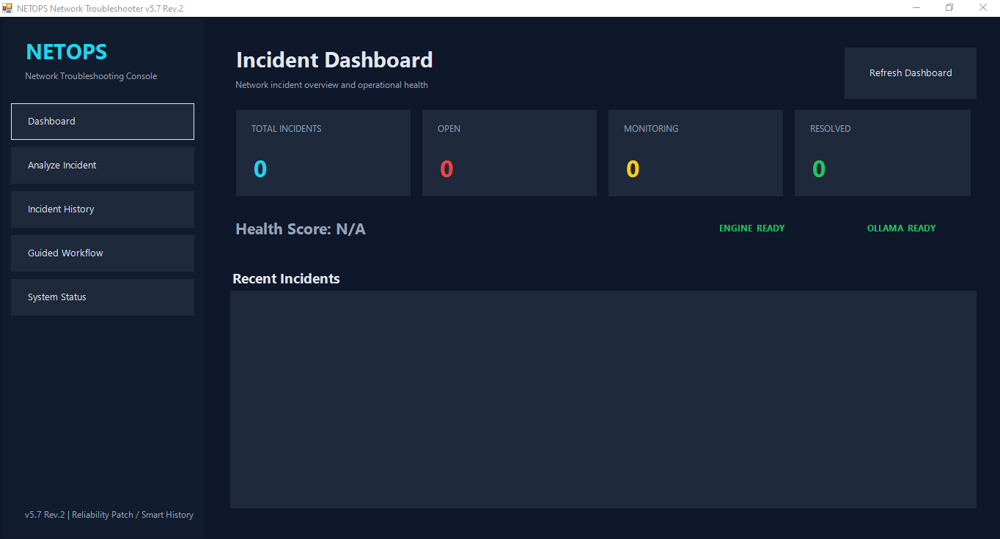

# 09 - NETOPS AI-Assisted Network Troubleshooting Platform



A practical Network Engineering and NOC troubleshooting platform built with PowerShell, deterministic rule-based diagnostics, evidence correlation, root-cause analysis, incident lifecycle management, Windows Forms GUI, automated reporting, and optional local Ollama AI integration.

**Current GUI Release:** NETOPS v5.8  
**Diagnostic Engine:** v5.7 Reliability Patch  
**Status:** Stable Lab / Portfolio Release  
**Focus:** CCNA + CCNP troubleshooting workflows

## Project Overview

NETOPS started as a PowerShell troubleshooting rule engine and evolved into a local Network Operations troubleshooting platform. It accepts incident descriptions and technical evidence, identifies root causes and symptoms, recommends the next troubleshooting command, saves incidents automatically, and tracks their operational lifecycle.

The current platform includes:

- Windows Forms troubleshooting GUI
- FAST deterministic analysis mode
- Optional HYBRID / local Ollama AI workflow
- Modular CCNA / CCNP rule pack
- Root-cause vs symptom classification
- Confidence scoring
- FIX / VERIFY / COLLECT_MORE / STOP decisions
- Smart next-step recommendations
- Automatic incident saving
- Incident History dashboard
- Incident Details panel
- Open Report / Open Incident Folder workflow
- Incident lifecycle tracking
- Dashboard counters and Health Score
- Recent Incidents table
- Markdown + JSON incident documentation
- CSV incident history
- Reliability regression testing
- Professional Desktop shortcut / application icon workflow

## v5.8 Dashboard Integration & Incident Lifecycle

The v5.8 update focused on turning the GUI into a more realistic NOC-style incident console while keeping the v5.7 diagnostic engine stable.

### Dashboard integration

The Dashboard now reads directly from the Project 09 incident history and displays live operational counters:

- **Total Incidents**
- **Open**
- **Monitoring**
- **Resolved**
- **Health Score**

The Health Score reacts to active incidents:

- Open / Investigating incidents reduce the score by 25 points each.
- Monitoring incidents reduce the score by 10 points each.
- A fully resolved incident set returns the dashboard to 100/100.

### Incident lifecycle

NETOPS now supports a practical incident workflow:

```text
OPEN -> MONITORING -> RESOLVED
```

This lifecycle was tested successfully with incident `INC-20260821-017`:

```text
OPEN
Total: 17 | Open: 1 | Monitoring: 0 | Resolved: 16
Health Score: 75/100 - ATTENTION

MONITORING
Total: 17 | Open: 0 | Monitoring: 1 | Resolved: 16
Health Score: 90/100 - HEALTHY

RESOLVED
Total: 17 | Open: 0 | Monitoring: 0 | Resolved: 17
Health Score: 100/100 - HEALTHY
```

### Recent Incidents

The Dashboard Recent Incidents section now shows the latest incident records with professional operational fields:

| Field | Purpose |
|---|---|
| Incident ID | Unique incident reference |
| Created | Creation timestamp |
| Status | Open / Monitoring / Resolved |
| Category | VLAN, DHCP, OSPF, GRE, etc. |
| Severity | HIGH / MEDIUM / LOW |
| Confidence | Diagnostic confidence score |
| Decision | FIX / VERIFY / COLLECT_MORE / STOP |

Recent incidents are sorted by `IncidentID` descending so the newest incident is displayed first.

## v5.7 Rev.2 Reliability Patch

The diagnostic engine remains on the tested v5.7 reliability release.

### Reliability fixes

1. **IPv6 Default Gateway false-positive fix**
   - Windows-style output can place an IPv6 gateway on the line after `Default Gateway:`.
   - The engine no longer reports `Default Gateway missing` when a valid IPv6 gateway is present on the next line.

2. **GRE Tunnel Source / Destination mismatch detection**
   - Supports tunnel destination mismatch, incorrect destination, wrong source, and GRE endpoint mismatch wording.

3. **Multi-root-cause VLAN + DHCP analysis**
   - The engine can detect an explicit access-port VLAN mismatch while simultaneously diagnosing DHCP/APIPA problems.

4. **Version synchronization**
   - Diagnostic engine header uses v5.7.
   - GUI/dashboard release is v5.8.

## Validation Results

### Full Rule Pack Regression Suite

```text
PASSED : 27
FAILED : 0
NETOPS v5.3 RULE PACK: READY
```

### v5.7 Rev.2 Reliability Regression Suite

```text
PASSED : 8
FAILED : 0
NETOPS v5.7 RELIABILITY PATCH REV.2: READY
```

### Real GUI Retests

| Test | Result | Key Finding |
|---|---|---|
| IPv6 default route | PASS | IPv6 Default Route Missing, 98% confidence |
| GRE destination mismatch | PASS | GRE Tunnel Source/Destination Misconfiguration, 98% confidence |
| VLAN + DHCP multi-root cause | PASS | VLAN mismatch + DHCP Relay Missing + APIPA symptoms |
| Incident lifecycle | PASS | OPEN -> MONITORING -> RESOLVED |
| Dashboard counters | PASS | Total/Open/Monitoring/Resolved update correctly |
| Health Score | PASS | 75 -> 90 -> 100 during lifecycle test |

## Practical CCNA / CCNP Tests Completed

The platform has been manually tested with scenarios including:

- VLAN access-port mismatch
- Trunk allowed VLAN mismatch
- DHCP relay missing
- APIPA addressing
- Missing default gateway
- IPv6 default route missing
- OSPF area mismatch
- OSPF MTU mismatch / EXSTART
- EIGRP autonomous-system mismatch
- BGP remote-AS mismatch
- NAT ACL missing source subnet
- IPsec crypto parameter mismatch
- GRE tunnel endpoint mismatch
- Multiple simultaneous network faults

## Modular Rule Coverage

The engine uses modular PowerShell rules covering:

- Layer 2 / VLAN / trunking
- DHCP / DNS / IPv4
- Routing
- OSPF
- EIGRP
- BGP
- ACL / NAT
- Network security controls
- VPN / WAN / GRE / IPsec
- IPv6

## Incident Management

Every analyzed incident can be stored under the project data directory with structured documentation.

```text
data/
├── Incident-History.csv
├── Incidents/
│   └── INC-YYYYMMDD-XXX/
│       ├── incident.json
│       ├── incident-report.md
│       ├── analysis.txt
│       └── incident-description.txt
└── Reports/
```

The GUI supports:

- Refresh History
- View Incident Details
- Open Report
- Open Incident Folder
- Mark Resolved
- Lifecycle status tracking
- Dashboard live counters
- Recent incident review

## Decision Engine

NETOPS uses four primary decisions:

- **FIX** - a root cause is confirmed strongly enough to proceed with a controlled correction.
- **VERIFY** - a probable root cause exists but should be validated before configuration changes.
- **COLLECT_MORE** - additional evidence is required.
- **STOP** - available evidence is insufficient for a safe diagnosis.

## Example Troubleshooting Output

```text
[HIGH] [CONFIRMED] [ROOT_CAUSE] VLAN
Problem    : Access Port VLAN Mismatch.
Evidence   : Fa0/2 should be in VLAN 10 but is configured in VLAN 20.
Confidence : 99%
Interface  : Fa0/2

[HIGH] [CONFIRMED] [ROOT_CAUSE] DHCP
Problem    : DHCP Relay Missing.
Confidence : 98%

DECISION
FIX

SMART NEXT STEP
show interfaces Fa0/2 switchport
```

## Technologies

- PowerShell
- Windows Forms
- Cisco IOS troubleshooting concepts
- IPv4 / IPv6
- VLAN / 802.1Q trunking
- DHCP / DNS
- Static and dynamic routing
- OSPF / EIGRP / BGP
- ACL / NAT / PAT
- GRE / IPsec VPN
- Regular expressions
- Evidence correlation
- Root Cause Analysis
- Incident Management
- Markdown / JSON / CSV reporting
- Ollama
- Llama 3.2

## Skills Demonstrated

- Network troubleshooting methodology
- Cisco IOS diagnostics
- Layer 2 and Layer 3 fault isolation
- Routing-protocol troubleshooting
- Network security troubleshooting
- Root Cause Analysis
- Evidence correlation
- PowerShell automation
- GUI application development
- Incident lifecycle management
- Dashboard / operational status design
- Regression testing
- Technical documentation
- Network automation / DevNet fundamentals

## Intended Roles

- Junior Network Engineer
- NOC Technician
- Network Support Engineer
- Network Administrator
- Junior Network Automation / DevNet Engineer

## Release Notes

The v5.7 reliability notes are available in [`docs/NETOPS-v5.7-Rev2-Release.md`](./docs/NETOPS-v5.7-Rev2-Release.md). The v5.8 dashboard and lifecycle improvements are summarized in this README.

## Disclaimer

This is a lab and portfolio project. Diagnostic rules and configuration recommendations must be validated before use in production networks.
