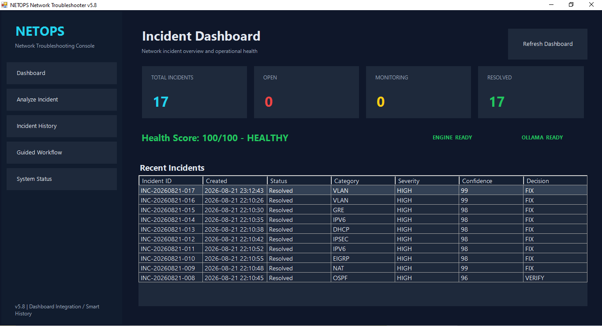

# 09 - NETOPS Network Troubleshooter v6.0



A practical Network Engineering and NOC troubleshooting platform built with PowerShell, deterministic rule-based diagnostics, evidence correlation, root-cause analysis, incident lifecycle management, Windows Forms GUI, automated reporting, and optional local Ollama AI integration.

**Current GUI Release:** NETOPS v6.0  
**Diagnostic Engine:** Deterministic CCNA/CCNP RCA + Hybrid AI Fusion  
**Status:** Completed Portfolio Release  
**Focus:** CCNA + CCNP troubleshooting workflows


## Latest Engine Improvements

### Natural English Normalizer
NETOPS now recognizes common natural-English CCNA/CCNP incident descriptions for VLAN, Trunk, DHCP, OSPF, EIGRP, BGP, NAT, GRE, IPsec and IPv6 troubleshooting.

### Dependency-Aware Smart Next Step
NETOPS prioritizes troubleshooting using network dependencies: Layer 2 -> IP/DHCP -> Routing -> ACL/NAT -> VPN. In multi-problem incidents this helps select the most logical first troubleshooting command.

## Project Overview

NETOPS started as a PowerShell troubleshooting rule engine and evolved into a local Network Operations troubleshooting platform. It accepts incident descriptions and technical evidence, identifies root causes and symptoms, recommends the next troubleshooting command, saves incidents automatically, and tracks their operational lifecycle.

The current platform includes:

- Windows Forms troubleshooting GUI
- FAST deterministic analysis mode
- Optional HYBRID / local Ollama AI workflow
- Modular CCNA / CCNP rule pack
- Root-cause vs symptom classification
- Confidence scoring
- FIX / VERIFY / COLLECT_MORE / STOP decisions
- Smart next-step recommendations
- Automatic incident saving
- Incident History dashboard
- Incident Details panel
- Open Report / Open Incident Folder workflow
- Incident lifecycle tracking
- Dashboard counters and Health Score
- Recent Incidents table
- Markdown + JSON incident documentation
- CSV incident history
- Reliability regression testing
- Professional Desktop shortcut / application icon workflow

## v6.0 Incident Lifecycle & Analysis Platform

NETOPS v6.0 expands the project into a complete network incident-analysis workflow.

### Key v6.0 Capabilities

- Incident Workspace
- Active Incident tracking
- Structured per-incident evidence
- Log Correlation
- Routing Analysis
- Wireshark / TShark Packet Capture
- Packet Analysis
- Root Cause Analysis
- RCA + Hybrid AI Fusion
- Evidence Health Score
- Full Incident Analysis
- Post-Fix Verification
- Controlled Incident Closure

### Incident Lifecycle

CREATE INCIDENT -> COLLECT EVIDENCE -> ANALYZE -> RCA -> HYBRID AI -> FULL ANALYSIS -> VERIFY -> CLOSE

### Incident Workspace

Each incident stores its own Logs, Packet Captures, Routing evidence, RCA reports, Hybrid AI reports, Config Backups, Final Reports and Verification evidence.

### Incident Dashboard

The dashboard displays RCA classification, Severity, Confidence, Decision, Evidence Health Score, latest activity and evidence counts.

Example:

RCA: ROUTING / INTERFACE FAILURE
Severity: HIGH
Confidence: HIGH
Decision: FIX / VERIFY
Evidence Health: 100/100 (STRONG)

Evidence Health represents evidence completeness, not proof that the network is healthy.

### Root Cause Analysis

NETOPS correlates interface, routing, log and packet evidence into a deterministic RCA verdict.

Example failure chain:

Interface DOWN -> OSPF Neighbor DOWN -> Route Loss -> Connectivity Failure

### RCA + Hybrid AI Fusion

Deterministic RCA remains the primary technical conclusion.
Local Ollama AI is used to enrich explanation, remediation, verification commands and closure notes.

Tested model: llama3.2:3b

### Packet Capture & Analysis

NETOPS integrates Wireshark, TShark and Npcap for packet capture and analysis of ARP, DNS, ICMP, TCP, UDP and OSPF traffic.

### Full Incident Analysis

NETOPS generates a consolidated Final Incident Report and checks evidence completeness before closure.

### Post-Fix Verification

Incident closure requires:

- Interface: PASSED
- OSPF Adjacency: PASSED
- Routing: PASSED
- Connectivity: PASSED

Only after all required checks pass does NETOPS return READY FOR CLOSURE.

## v5.7 Rev.2 Reliability Patch

The diagnostic engine remains on the tested v5.7 reliability release.

### Reliability fixes

1. **IPv6 Default Gateway false-positive fix**
   - Windows-style output can place an IPv6 gateway on the line after `Default Gateway:`.
   - The engine no longer reports `Default Gateway missing` when a valid IPv6 gateway is present on the next line.

2. **GRE Tunnel Source / Destination mismatch detection**
   - Supports tunnel destination mismatch, incorrect destination, wrong source, and GRE endpoint mismatch wording.

3. **Multi-root-cause VLAN + DHCP analysis**
   - The engine can detect an explicit access-port VLAN mismatch while simultaneously diagnosing DHCP/APIPA problems.

4. **Version synchronization**
   - Diagnostic engine header uses v5.7.
   - GUI/dashboard release is v5.8.

## Validation Results

### Full Rule Pack Regression Suite

```text
PASSED : 27
FAILED : 0
NETOPS v5.3 RULE PACK: READY
```

### v5.7 Rev.2 Reliability Regression Suite

```text
PASSED : 8
FAILED : 0
NETOPS v5.7 RELIABILITY PATCH REV.2: READY
```

### Real GUI Retests

| Test | Result | Key Finding |
|---|---|---|
| IPv6 default route | PASS | IPv6 Default Route Missing, 98% confidence |
| GRE destination mismatch | PASS | GRE Tunnel Source/Destination Misconfiguration, 98% confidence |
| VLAN + DHCP multi-root cause | PASS | VLAN mismatch + DHCP Relay Missing + APIPA symptoms |
| Incident lifecycle | PASS | OPEN -> MONITORING -> RESOLVED |
| Dashboard counters | PASS | Total/Open/Monitoring/Resolved update correctly |
| Health Score | PASS | 75 -> 90 -> 100 during lifecycle test |

## Practical CCNA / CCNP Tests Completed

The platform has been manually tested with scenarios including:

- VLAN access-port mismatch
- Trunk allowed VLAN mismatch
- DHCP relay missing
- APIPA addressing
- Missing default gateway
- IPv6 default route missing
- OSPF area mismatch
- OSPF MTU mismatch / EXSTART
- EIGRP autonomous-system mismatch
- BGP remote-AS mismatch
- NAT ACL missing source subnet
- IPsec crypto parameter mismatch
- GRE tunnel endpoint mismatch
- Multiple simultaneous network faults

## Modular Rule Coverage

The engine uses modular PowerShell rules covering:

- Layer 2 / VLAN / trunking
- DHCP / DNS / IPv4
- Routing
- OSPF
- EIGRP
- BGP
- ACL / NAT
- Network security controls
- VPN / WAN / GRE / IPsec
- IPv6

## Incident Management

Every analyzed incident can be stored under the project data directory with structured documentation.

```text
data/
|-- Incident-History.csv
|-- Incidents/
|   `-- INC-YYYYMMDD-XXX/
|       |-- incident.json
|       |-- incident-report.md
|       |-- analysis.txt
|       `-- incident-description.txt
`-- Reports/
```

The GUI supports:

- Refresh History
- View Incident Details
- Open Report
- Open Incident Folder
- Mark Resolved
- Lifecycle status tracking
- Dashboard live counters
- Recent incident review

## Decision Engine

NETOPS uses four primary decisions:

- **FIX** - a root cause is confirmed strongly enough to proceed with a controlled correction.
- **VERIFY** - a probable root cause exists but should be validated before configuration changes.
- **COLLECT_MORE** - additional evidence is required.
- **STOP** - available evidence is insufficient for a safe diagnosis.

## Example Troubleshooting Output

```text
[HIGH] [CONFIRMED] [ROOT_CAUSE] VLAN
Problem    : Access Port VLAN Mismatch.
Evidence   : Fa0/2 should be in VLAN 10 but is configured in VLAN 20.
Confidence : 99%
Interface  : Fa0/2

[HIGH] [CONFIRMED] [ROOT_CAUSE] DHCP
Problem    : DHCP Relay Missing.
Confidence : 98%

DECISION
FIX

SMART NEXT STEP
show interfaces Fa0/2 switchport
```

## Technologies

- PowerShell
- Windows Forms
- Cisco IOS troubleshooting concepts
- IPv4 / IPv6
- VLAN / 802.1Q trunking
- DHCP / DNS
- Static and dynamic routing
- OSPF / EIGRP / BGP
- ACL / NAT / PAT
- GRE / IPsec VPN
- Regular expressions
- Evidence correlation
- Root Cause Analysis
- Incident Management
- Markdown / JSON / CSV reporting
- Ollama
- Llama 3.2

## Skills Demonstrated

- Network troubleshooting methodology
- Cisco IOS diagnostics
- Layer 2 and Layer 3 fault isolation
- Routing-protocol troubleshooting
- Network security troubleshooting
- Root Cause Analysis
- Evidence correlation
- PowerShell automation
- GUI application development
- Incident lifecycle management
- Dashboard / operational status design
- Regression testing
- Technical documentation
- Network automation / DevNet fundamentals

## Intended Roles

- Junior Network Engineer
- NOC Technician
- Network Support Engineer
- Network Administrator
- Junior Network Automation / DevNet Engineer

## Release Notes

The v5.7 reliability notes are available in [`docs/NETOPS-v5.7-Rev2-Release.md`](./docs/NETOPS-v5.7-Rev2-Release.md). The v5.8 dashboard and lifecycle improvements are summarized in this README.

## Disclaimer

This is a lab and portfolio project. Diagnostic rules and configuration recommendations must be validated before use in production networks.


