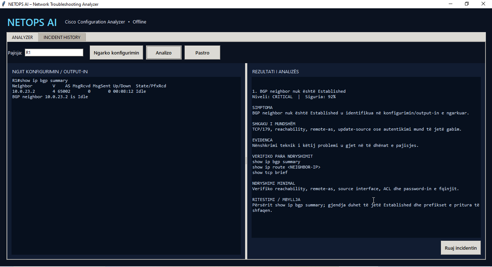
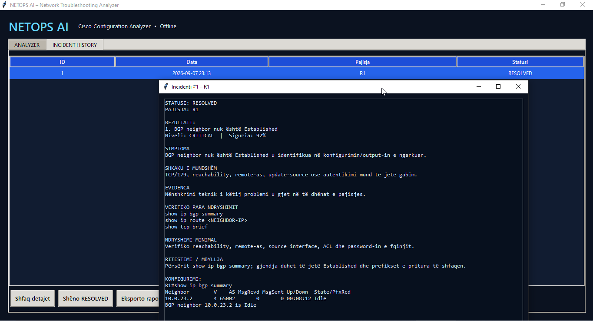

# Project 10 — NETOPS AI Python Troubleshooting Analyzer


NETOPS AI is an offline Windows desktop application for structured network troubleshooting. It analyzes Cisco IOS configurations and operational command output, detects common CCNA/CCNP faults, compares two devices, records incidents in SQLite, and exports professional incident reports.

The project follows an evidence-first workflow:

`Symptom → probable root cause → evidence → verification → minimal change → retest`

## Application preview

### Configuration analyzer



### Incident history



## Core capabilities

- Analyze pasted or imported Cisco IOS configuration and `show` command output.
- Detect the device name from `hostname R1` or prompts such as `R1#` and `SW1#`.
- Compare two devices and report concrete configuration mismatches.
- Store incidents locally with `ACTIVE` and `RESOLVED` states.
- Export incident reports to printable HTML/PDF.
- Run offline without sending configurations to cloud services.
- Build a standalone Windows executable with PyInstaller.

## Troubleshooting coverage

| Domain | Examples |
|---|---|
| Physical / interfaces | Link down, `notconnect`, CRC errors, duplex mismatch, `err-disabled` |
| Switching | Access VLAN, allowed/native VLAN, STP inconsistency, EtherChannel/LACP/PAgP |
| Inter-VLAN routing | Missing 802.1Q encapsulation, default-gateway issues |
| Services | DHCP/APIPA/pool exhaustion and DNS failures |
| Routing | OSPF area, timers, MTU and authentication; EIGRP K-values; BGP Idle/Active |
| Security / edge | ACL denies, NAT translations, HSRP and IPsec/IKE VPN status |
| Device comparison | OSPF area, BGP remote-AS, subnet, trunk VLAN and EtherChannel mode mismatches |

## Repository structure

```text
10-NETOPS-AI-Python-Troubleshooting-Analyzer/
├── src/netops_ai.py
├── tests/test_analyzer.py
├── scenarios/
├── compare-sample/
├── screenshots/
├── tools/
├── Start-NETOPS-AI.bat
├── Build-Windows-EXE.ps1
├── Create-Desktop-Shortcut.ps1
└── README.md
```

## Quick start from source

Requirements: Windows 10/11 and Python 3.13.

```powershell
py -3.13 .\src\netops_ai.py
```

The application uses only Python standard-library modules at runtime: Tkinter, SQLite, pathlib, ipaddress, HTML and regular expressions.

## Build the Windows executable

Run from PowerShell:

```powershell
.\Build-Windows-EXE.ps1
```

The executable is generated at:

```text
dist\NETOPS-AI.exe
```

To create a desktop shortcut:

```powershell
.\Create-Desktop-Shortcut.ps1
```

## Test

```powershell
py -3.13 -m unittest -v tests\test_analyzer.py
```

The repository includes ready-to-use scenarios for BGP, OSPF, DHCP/APIPA, DNS, NAT, ACL, VPN, EtherChannel, physical errors and `err-disabled` ports.

## Local data and privacy

The packaged application stores its SQLite database at:

```text
%LOCALAPPDATA%\NETOPS-AI\netops_ai.db
```

Database files, generated reports, build output and device configurations are excluded from Git. Do not commit production configurations, credentials, private IP plans or incident data. Use the tool only on networks and devices you are authorized to manage.

## Current release

**v3.1 — Completed**

- Offline Python analysis engine
- Device comparison module
- SQLite incident history
- HTML/PDF reporting workflow
- Windows executable build
- Desktop shortcut and application icon

## Author

**Driton Maliqi**  
Network Engineering Portfolio — CCNA/CCNP Troubleshooting and Automation
