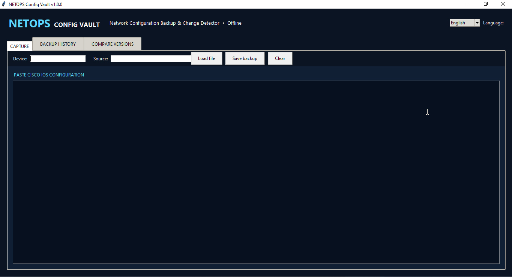
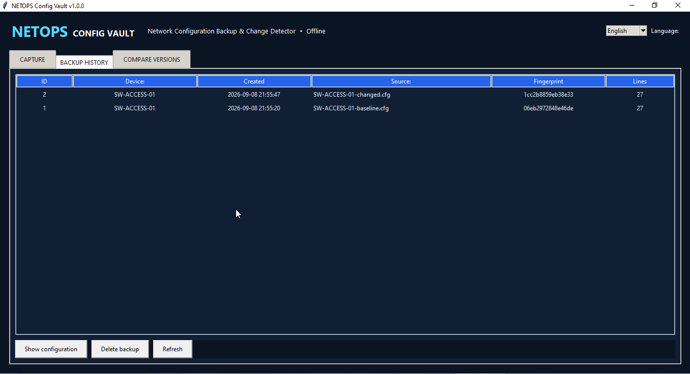
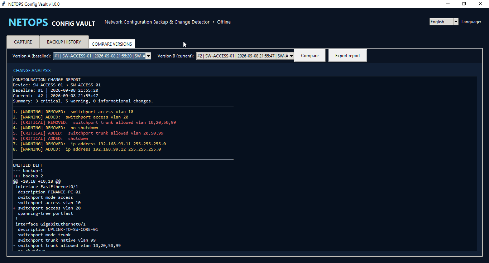

# Project 11 – Network Configuration Backup & Change Detector


NETOPS Config Vault is a bilingual desktop application for creating local backups of Cisco IOS configurations, tracking version history, detecting changes, and assessing operational risk. It was designed as a practical portfolio project for CCNA/CCNP study and day-to-day Network Engineering work.

## Application Preview

### Configuration Capture



### Backup History



### Change Analysis



## Key Features

- Offline operation with no cloud account or API key required
- English and Albanian interface
- Cisco hostname detection from configuration text
- Configuration import from `.txt`, `.cfg`, `.conf`, and `.log` files
- SQLite backup history grouped by device and capture time
- SHA-256 fingerprinting and duplicate-backup prevention
- Side-by-side version selection
- Added/removed command detection
- Critical, warning, and informational risk classification
- Unified configuration diff
- UTF-8 text report export
- Windows executable build and Desktop shortcut scripts

## Risk Examples

| Level | Example changes |
| --- | --- |
| Critical | `shutdown`, removal of an IP address/route/neighbor, trunk allowed-VLAN modification, deny-all ACL |
| Warning | VLAN assignment, IP address, routing network, neighbor, helper address, STP or EtherChannel change |
| Informational | Hostname, descriptions, banners and other low-impact commands |

Risk labels are decision support, not authorization to change a production device. Every proposed action should follow the organization's approval, backup, maintenance-window, and rollback procedures.

## Quick Start

```powershell
cd "C:\Path\To\Project-11-Network-Configuration-Backup-Change-Detector"
py -3.13 .\netops_backup.py
```

Load or paste a baseline configuration and save it. Save a later configuration for the same device, open **Compare Versions**, select both backups, and click **Compare**.

## Windows EXE

Run PowerShell in the project folder:

```powershell
powershell.exe -NoProfile -ExecutionPolicy Bypass -File .\Build-Windows-EXE.ps1
powershell.exe -NoProfile -ExecutionPolicy Bypass -File .\Create-Desktop-Shortcut.ps1
```

The packaged application stores its database at:

```text
%LOCALAPPDATA%\NETOPS-Config-Vault\config_vault.db
```

## Tests

```powershell
py -3.13 -m unittest discover -s tests -v
```

## Project Structure

```text
netops_backup.py                 Main application and detection engine
Build-Windows-EXE.ps1           Builds the Windows executable
Create-Desktop-Shortcut.ps1     Creates a Desktop shortcut
Start-NETOPS-Config-Vault.bat   Starts the Python version
samples/                        Safe baseline and changed examples
tests/                          Automated unit tests
docs/RELEASE-NOTES-v1.0.0.md    Release documentation
```

## Privacy and Security

Configurations can contain usernames, IP addressing, SNMP strings, encrypted secrets, topology details, and other sensitive information. Sanitize real configurations before publishing or sharing them. The sample files in this repository contain fictional lab data only.

## Version

Version 1.0.0 – Completed.
