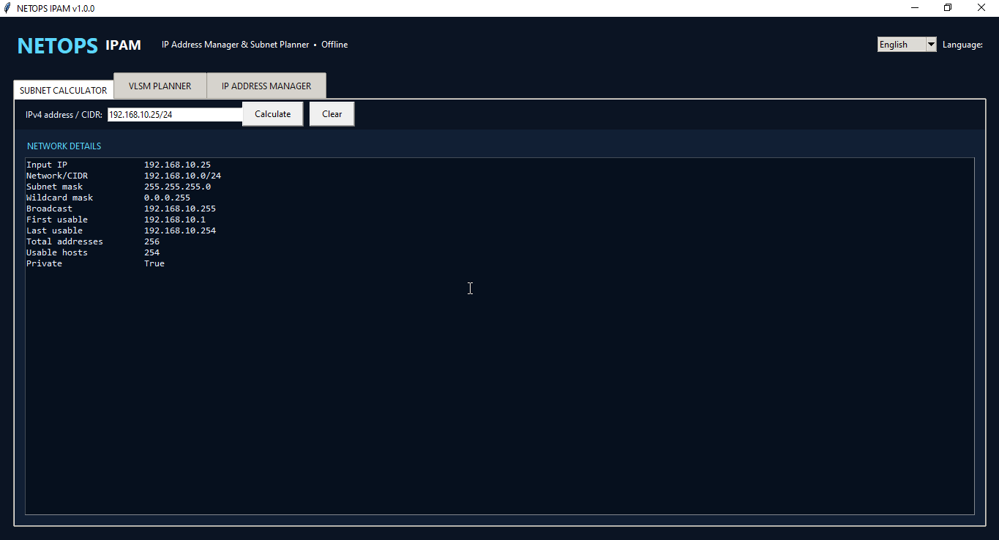
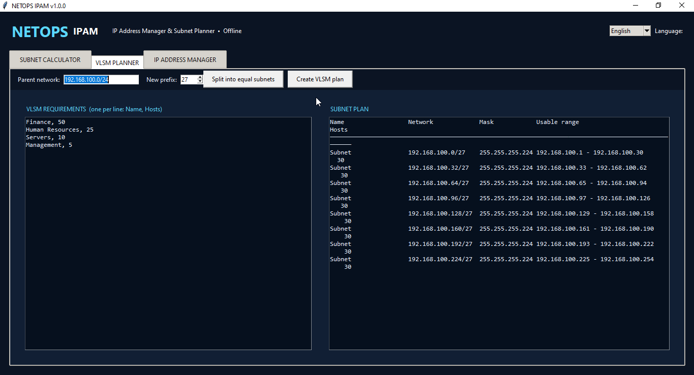
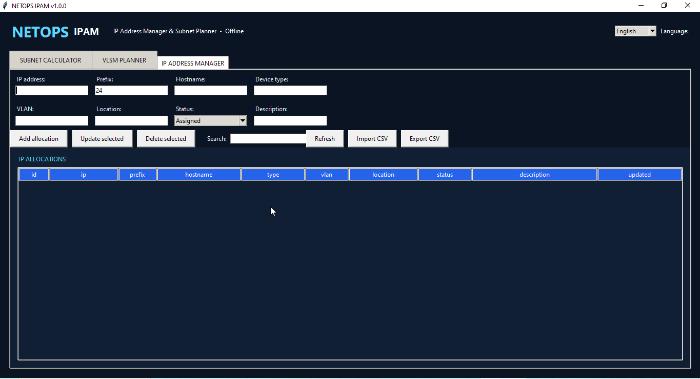

# Project 12 – IP Address Manager & Subnet Planner


NETOPS IPAM is a bilingual offline desktop application for IPv4 subnet calculation, equal-size subnetting, VLSM planning, and local IP address inventory. It provides a practical workflow for CCNA/CCNP labs, small-network documentation, and day-to-day Network Engineering tasks.

## Application Preview

### IPv4 Subnet Calculator

Calculate the network, subnet mask, wildcard mask, broadcast address, usable range, and host capacity from an IPv4/CIDR input.



### Equal-Size Subnet and VLSM Planner

Split a parent network into equal-size subnets or create a largest-requirement-first VLSM addressing plan.



### IP Address Manager

Document IP allocations with hostname, prefix, device type, VLAN, location, status, and description fields.



## Key Features

- English and Albanian user interface
- IPv4/CIDR subnet calculator
- Network address, mask, wildcard, broadcast and usable-host range
- Correct `/31` and `/32` handling
- Equal-size subnet generation with a safe 4,096-subnet limit
- VLSM planning based on department/segment host requirements
- Local SQLite IP allocation inventory
- IP, prefix, hostname, device type, VLAN, location, status and description fields
- Duplicate IP-address prevention
- Search, update and delete operations
- UTF-8 CSV import and export
- Windows executable build and Desktop shortcut scripts
- No API key, cloud service or device credentials required

## Quick Start

```powershell
cd "C:\Path\To\Project-12-IP-Address-Manager-Subnet-Planner"
py -3.13 .\netops_ipam.py
```

The included `samples/ipam-sample.csv` file can be imported from the **IP Address Manager** tab.

## Windows EXE

```powershell
powershell.exe -NoProfile -ExecutionPolicy Bypass -File .\Build-Windows-EXE.ps1
powershell.exe -NoProfile -ExecutionPolicy Bypass -File .\Create-Desktop-Shortcut.ps1
```

The packaged application stores its database in:

```text
%LOCALAPPDATA%\NETOPS-IPAM\netops_ipam.db
```

## Tests

```powershell
py -3.13 -m unittest discover -s tests -v
```

## Project Structure

```text
netops_ipam.py                 Tkinter desktop interface
ipam_core.py                   Calculator, VLSM and SQLite engine
Build-Windows-EXE.ps1          Windows executable builder
Create-Desktop-Shortcut.ps1    Desktop shortcut automation
samples/ipam-sample.csv        Fictional lab inventory
tests/test_ipam.py             Automated core tests
docs/RELEASE-NOTES-v1.0.0.md   Release documentation
```

## Operational Notes

This tool is intended for planning and documentation. Validate addressing plans against the approved network design before production use. The sample inventory contains fictional lab data only.

## Version

Version 1.0.0 – Completed.
