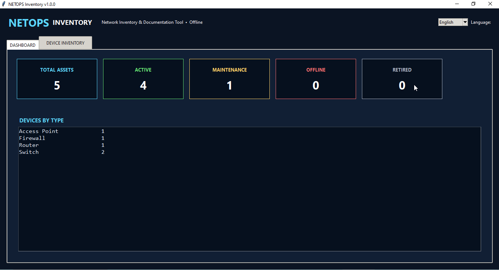
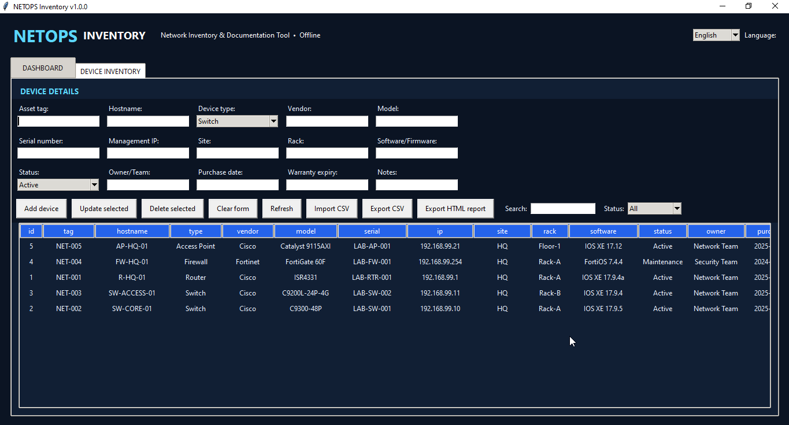
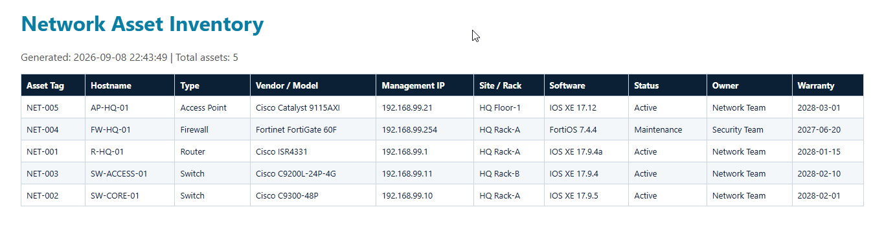

# Project 13 – Network Inventory & Documentation Tool


NETOPS Inventory is a bilingual offline desktop application for documenting network infrastructure assets. It centralizes operational details for routers, switches, firewalls, access points, servers, and other devices in a searchable local SQLite inventory.

## Application Preview

### Asset Dashboard

Review total assets and operational status at a glance, with device counts grouped by infrastructure type.



### Device Inventory

Maintain structured records for routers, switches, firewalls, access points, servers, and other network assets.



### Professional HTML Report

Generate a portable inventory report for documentation, review, printing, or conversion to PDF.



## Key Features

- English and Albanian interface
- Dashboard for total, active, maintenance, offline, and retired assets
- Device counts grouped by type
- Asset tag, hostname, vendor, model, serial number, and management IPv4 address
- Site, rack, software/firmware, operational status, owner/team, purchase date, warranty, and notes
- Duplicate protection for asset tag, hostname, and management IP
- Search and status filtering
- Add, update, and delete workflows
- UTF-8 CSV import and export
- Professional standalone HTML inventory report
- Local SQLite storage
- Windows executable and Desktop shortcut scripts

## Quick Start

```powershell
cd "C:\Path\To\Project-13-Network-Inventory-Documentation-Tool"
py -3.13 .\netops_inventory.py
```

Import `samples/network-inventory-sample.csv` to populate the application with fictional lab assets.

## Windows EXE

```powershell
powershell.exe -NoProfile -ExecutionPolicy Bypass -File .\Build-Windows-EXE.ps1
powershell.exe -NoProfile -ExecutionPolicy Bypass -File .\Create-Desktop-Shortcut.ps1
```

Packaged database location:

```text
%LOCALAPPDATA%\NETOPS-Inventory\network_inventory.db
```

## Tests

```powershell
py -3.13 -m unittest discover -s tests -v
```

## Security and Data Quality

The application does not connect to production devices or collect credentials. Real asset inventories may be sensitive; follow organizational access-control, backup, retention, and data-classification requirements. The included dataset is fictional.

## Version

Version 1.0.0 – Completed.
