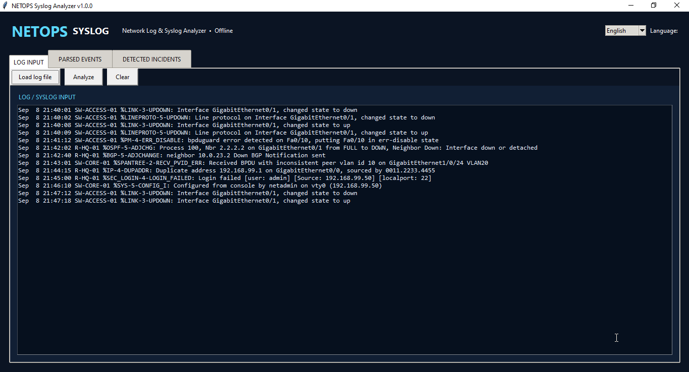
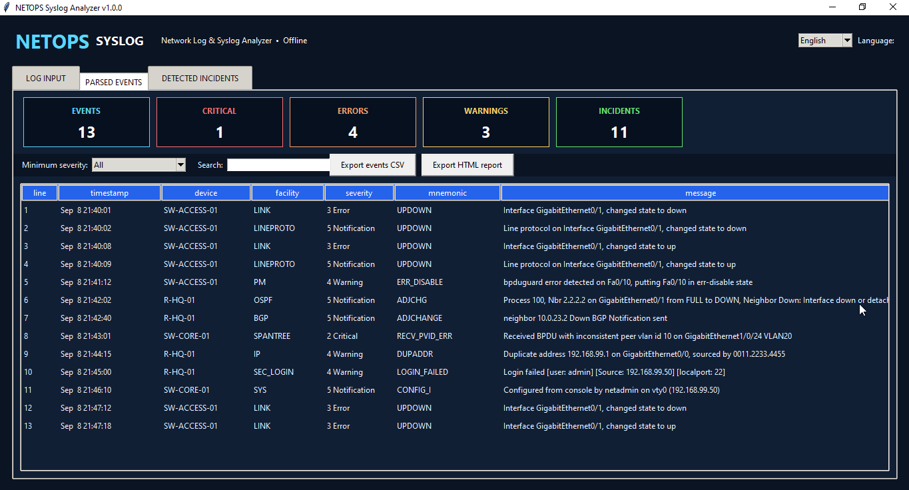
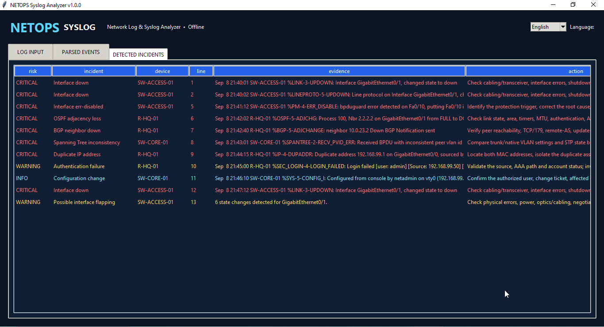
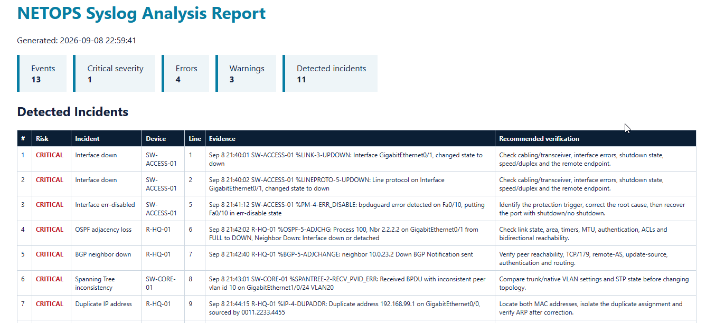

# Project 14 – Network Log & Syslog Analyzer


NETOPS Syslog Analyzer is a bilingual offline desktop application that converts Cisco IOS and common syslog text into structured events, operational statistics, and rule-based network incident findings.

## Application Preview

### Log Input

Load a `.log` or `.txt` file, or paste Cisco/syslog messages directly into the analyzer.



### Parsed Events and Severity Dashboard

Review normalized timestamps, devices, facilities, severity levels, mnemonics, and messages with filtering and search.



### Rule-Based Incident Detection

Prioritize detected faults with risk, evidence, affected device, source line, and recommended verification.



### Professional HTML Report

Export a portable incident report for documentation, review, printing, or conversion to PDF.



## Key Features

- English and Albanian interface
- Cisco `%FACILITY-SEVERITY-MNEMONIC` parsing
- RFC 3164 priority/severity support
- Syslog severity levels 0–7
- Timestamp, hostname, facility, mnemonic and message extraction
- Event search and minimum-severity filtering
- Dashboard counters for critical, error and warning events
- Rule-based detection for interface failures, err-disabled ports, OSPF/BGP adjacency loss, duplicate IPs, STP inconsistency, authentication failures, HSRP changes, CPU/memory conditions and configuration changes
- Possible interface-flapping detection
- CSV event export
- Professional HTML incident report
- Offline processing with no API key or device credentials

## Quick Start

```powershell
cd "C:\Path\To\Project-14-Network-Log-Syslog-Analyzer"
py -3.13 .\netops_syslog.py
```

Load `samples/cisco-syslog-sample.log`, click **Analyze**, and review **Parsed Events** and **Detected Incidents**.

## Windows EXE

```powershell
powershell.exe -NoProfile -ExecutionPolicy Bypass -File .\Build-Windows-EXE.ps1
powershell.exe -NoProfile -ExecutionPolicy Bypass -File .\Create-Desktop-Shortcut.ps1
```

## Tests

```powershell
py -3.13 -m unittest discover -s tests -v
```

## Operational Notes

Rule-based findings prioritize investigation; they do not prove root cause. Correlate timestamps, topology, change records, device state and packet-path evidence before making production changes. Sanitize real logs before public sharing because they may expose IP addresses, usernames and infrastructure details.

## Version

Version 1.0.0 – Completed.
