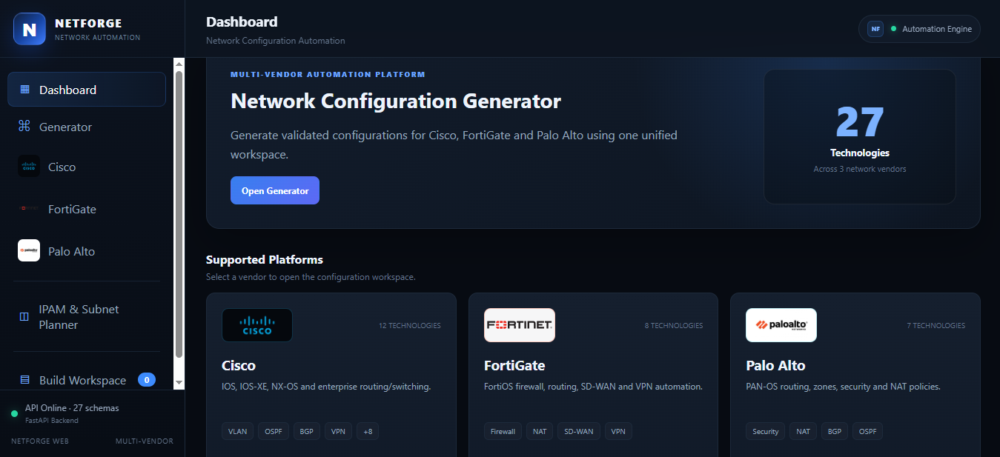
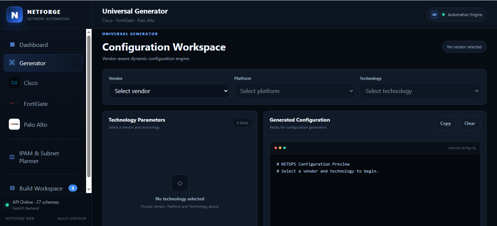
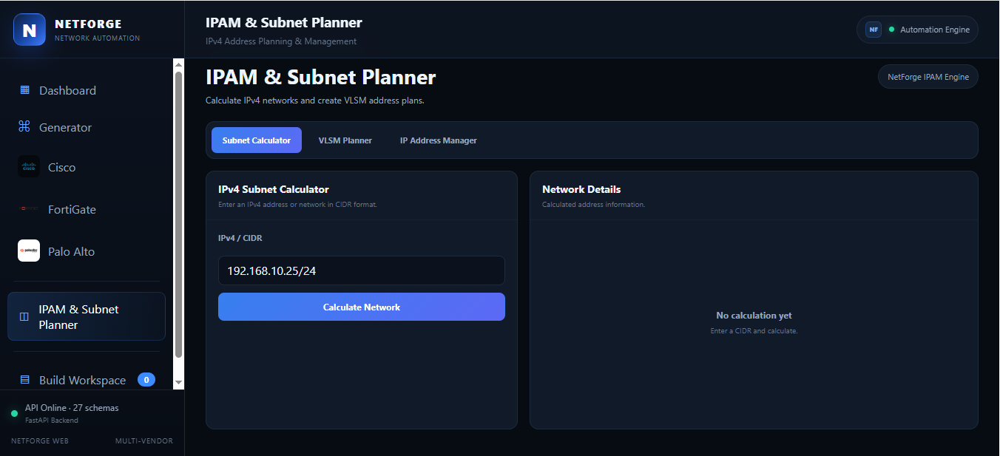
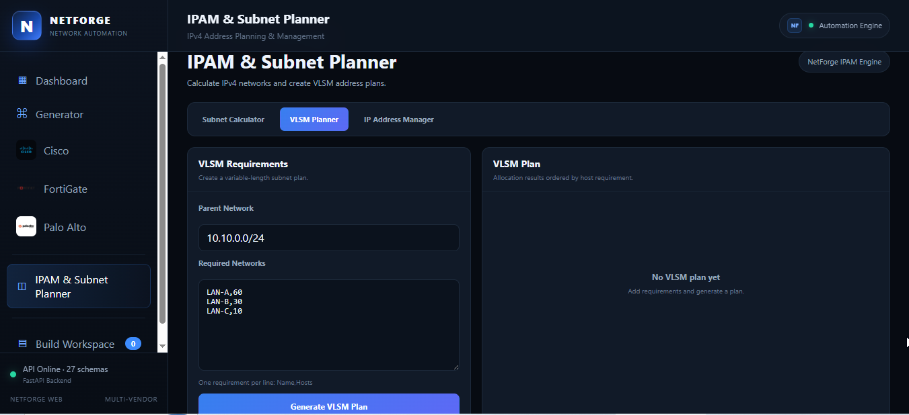
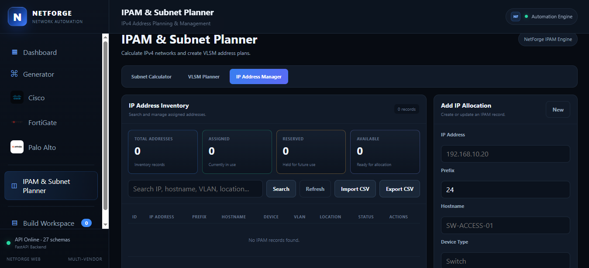
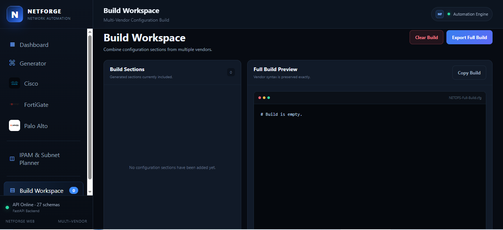

# NETFORGE

## Network Automation Platform

NETFORGE is a multi-vendor network automation and IP address management platform for configuration generation, validation, subnet planning, VLSM, IPAM, and network engineering workflows.

Current release: **v1.0.0**

## Main Features

- Cisco configuration generation
- FortiGate configuration generation
- Palo Alto configuration generation
- 27 supported configuration technologies
- Dynamic parameter forms
- Validation engine
- Build Workspace
- IPv4 Subnet Calculator
- Subnet Split
- VLSM Planner
- SQLite IP Address Manager
- CSV Import / Export
- FastAPI backend
- Web-based frontend

## Supported Vendors

### Cisco - 12 Technologies

- BGP
- OSPF
- IS-IS
- VLAN
- Trunk
- NAT / PAT
- HSRP
- VRF
- IPsec VPN
- ACL
- DHCP
- Static Route

### FortiGate - 8 Technologies

- Interface
- Static Route
- Firewall Policy
- NAT
- BGP
- OSPF
- SD-WAN
- IPsec VPN

### Palo Alto - 7 Technologies

- Layer 3 Interface
- Zone
- Static Route
- Security Policy
- NAT Policy
- BGP
- OSPF

**Total configuration coverage: 27 / 27**

## Validation Engine

NETFORGE validates important network parameters before configuration generation.

Validation includes:

- VLAN IDs
- IPv4 addresses
- CIDR networks
- AS numbers
- Hostnames
- Subnet masks
- Interface names
- Port numbers
- Required fields

## Build Workspace

The Build Workspace allows multiple generated configuration sections to be combined into one larger configuration.

Features include:

- Multiple configuration sections
- Vendor metadata
- Platform metadata
- Technology metadata
- Duplicate protection
- Full build preview
- Clear workspace
- CFG export

## IPAM and Subnet Planner

NETFORGE includes an integrated IPv4 planning and IP address management module.

### Subnet Calculator

- Network address
- Prefix
- CIDR notation
- Subnet mask
- Wildcard mask
- Broadcast address
- First usable host
- Last usable host
- Total addresses
- Usable hosts

### VLSM Planner

The VLSM engine allocates subnet sizes according to host requirements.

### IP Address Manager

The IP Address Manager uses SQLite for persistent IP inventory.

- Add
- Search
- Edit
- Delete
- Duplicate IP prevention
- CSV import
- CSV export

## Technology Stack

- Backend: Python
- API: FastAPI
- API Server: Uvicorn
- Frontend: HTML / CSS / JavaScript
- Database: SQLite
- Launcher: PowerShell
- Data Exchange: JSON / CSV

## Running NETFORGE

Requirements:

- Windows 10 or Windows 11
- Python 3
- PowerShell
- Modern web browser

Install backend dependencies:

cd .\web-ui\backend
python -m pip install -r requirements.txt

Start NETFORGE:

cd ..
.\run.ps1

Backend: http://127.0.0.1:8000
Web UI: http://127.0.0.1:3000
FastAPI Docs: http://127.0.0.1:8000/docs

## Verification Status

NETFORGE v1.0.0 passed the final functional platform audit.

- FastAPI Engine: PASS
- Configuration Coverage: 27/27
- Multi-Vendor Generation: PASS
- Validation Engine: PASS
- Subnet Calculator: PASS
- Subnet Split: PASS
- VLSM Planner: PASS
- IPAM Database CRUD: PASS
- CSV Import / Export: PASS
- FastAPI Routes: PASS
- Web UI: PASS
- NETFORGE Branding: PASS
- Launcher: PASS

## Screenshots

Final NETFORGE screenshots will be stored in:

docs/screenshots/

Recommended screenshot set:

- 01-dashboard.png
- 02-universal-generator.png
- 03-cisco-generator.png
- 04-fortigate-generator.png
- 05-paloalto-generator.png
- 06-ipam-subnet-calculator.png
- 07-ipam-vlsm-planner.png
- 08-ip-address-manager.png
- 09-build-workspace.png

## Roadmap

Future development may include:

- Juniper Junos support
- Aruba support
- Additional firewall vendors
- Device inventory
- Configuration history
- User authentication
- SSH-based device integration
- Automated configuration deployment
- Configuration rollback
- Network discovery
- Enhanced IPAM analytics

## Disclaimer

NETFORGE generates configuration templates and planning information.

Generated configurations should always be reviewed and validated before use on production infrastructure.

Testing in a lab environment is strongly recommended.

## Author

**Driton Maliqi**

Network Engineering Portfolio

GitHub:

DritonMaliqi/Driton-Network-Engineering-Portfolio

---

**NETFORGE v1.0.0**

Multi-Vendor Network Automation | Validation | Build Workspace | IPAM | Subnet Planning

## NETFORGE Interface

### Dashboard

### Universal Generator

### Subnet Calculator

### VLSM Planner

### IP Address Manager

### Build Workspace

